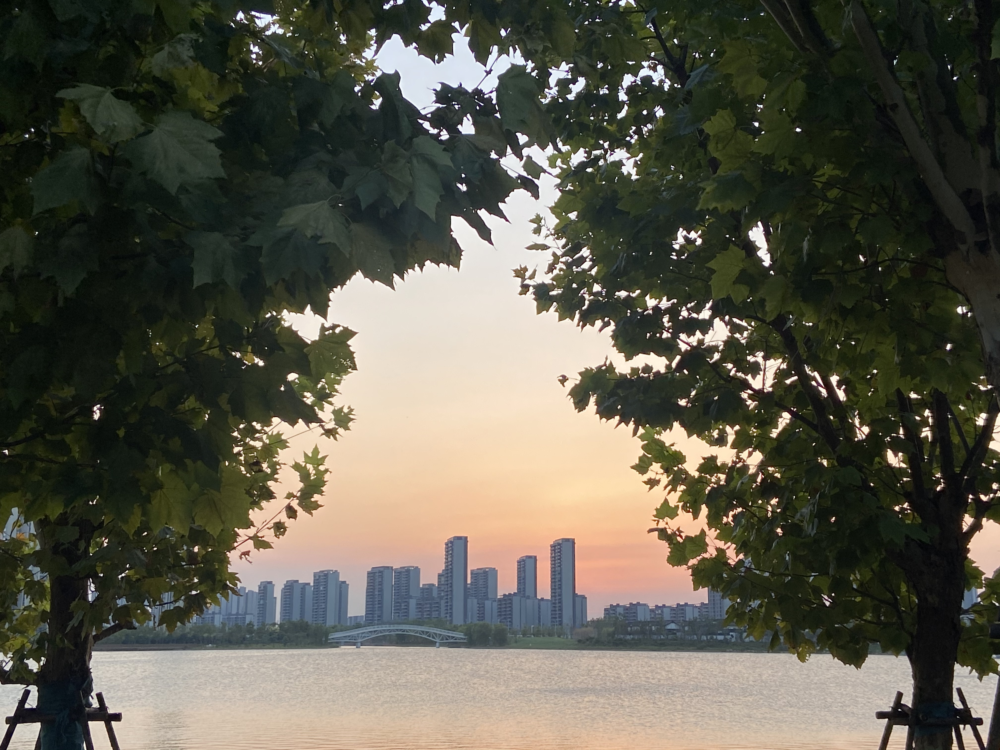

# 开启新生活

## 逃离技术

书接上文，八月底告别了上一份工作，迎来了短暂的自由，虽然也只有一周而已，hhhh。上班一年多，终于能够无忧无虑的躺着了。该如何利用好这段时间呢？本来打算出去玩，转念一想今年从五月份回杭州之后，也一直没回过家，还是去姐姐家歇了一周。工作的时候想着放假，但假期来的时候反倒不知自己该做些什么了，看看书，打打游戏，练练球，哈哈。

有时候就会明显感觉到自己被现在的生活说裹挟，被迫适应着过着。但当真正离开了之后就会发现，其实目前所在乎的也没那么重要，只不过是为了在这个陌生的城市生活，也才有了这一切。说不上差，当也会总觉得不好。有工作的生活是规律的，但也似乎是这种规律，导致自己被驯化了，就好像踏踏实实上班是理所当然的事情，为了固定的经济来源，哪怕做的不是自己太感兴趣的事情。。。既然这样，为何不逃离这个怪圈，去做点自己想做的事情呢。

远离互联网的生活才会发现，其实，我们所谈论的技术可能大多数人并不关心其是如何运行的，就好比整个社会的运作，大部分人都是做好自己的本职工作就行，也不会想为什么会这样，互联网的世界也是如此。在这一周里，我尽可能的不用手机和电脑，我想看看没了这些设备对我有哪些影响。首当其冲的是 AI，目前 AI 对我来说更多的是工作中的帮助，LLM 的出现已经彻底改变了我的工作习惯和方式，也就喜欢更多的去追寻更好用的工具，Cursor 就是之一，习惯了之后就回不去了，当有一天打开 IDE，定义一个变量之后，我还在等待它会继续补全什么。但这些在普通的日常生活中是不太用的上的，有些 APP 可能会提供一些 AI 的场景和功能，但总觉得有点刻意而为，比起 AI 给的信息，我更喜欢是自己做决策。所以什么时候 AI 能够真正给大部分人的生活带来改变，或者以什么方式来改变生活呢？还是挺期待的。

熙熙也长挺大了，快八个月了，上次见面还是四个月前，现如今自己能够爬高上低也是挺不的了的，不过对于看护的大人来说就要费神的多，所以过去的当天我妈和我姐就把小孩丢给了我，也是被折磨够了哈哈哈。对于我来说也是一个全新的体验，自己是不太喜欢小孩子的，不知该如何去沟通交流。但熙熙还好，看见了就很喜欢，好在她也不怎么怕生，我也是第一次抱小孩，也是格外小心翼翼，也有点小紧张，孩子的笑容也真的很治愈，这种笑容也是孩子所独有的。但对我我自己来说，大概率是不会要孩子的，因为我不知该如何去做一个父亲，还有就是个人比较自私，时间还是留给自己为好，哈哈。

还有就是有一次晚上散步，走到湖边，看见外面的景色还不错拍了一张照片，发给我家那位看，她说圣诞树，我先是一愣，心里想这不就普通的树吗，哪来的圣诞树。结果她说，两棵树之间树枝和树叶之间的空间。诶，一看确实是的。“生活中不缺少美，只是缺少发现美的眼睛”。

这个月开始玩《异度神剑 终极版》了，想玩《XB3》的 DLC，还是先把前作都玩一遍比较好。虽然是老游戏重新复刻，但玩起来还是很有意思，可能是自己比较喜欢 JRPG 这类游戏的原因吧。虽然故事情节比较老套中二，但玩起来还是很燃，也难怪会说男人至死是少年，哈哈哈哈。主线故事的情节设计的还不错，一波三折折上折，前期会留有悬念，通过后期每一次的反转填补上之前的悬念。不过有些地方的情节设计还需要一点铺垫，后半部分一个点接一个点太密集，对于游玩体验不是很好吧。这部的主角修尔克不太喜欢，太圣母了，尤其是得知机神兵里面是穆姆卡，搞不懂男主的脑回路还保护起来，有点抽象。不过丹邦给的印象就很不错，属于那种有勇有谋值得信赖的，而且还愿意牺牲自己。从内容上来说，没有 2 和 3 那么印象深刻，可能是最后的结局还没打。等完结了三部曲，单独写个博客记录一下吧。又给自己挖坑了属于是。

## 新篇章

也不知道从何时起开始对分布式和数据库感兴趣的，误打误撞入了大数据这个圈子，偶然的机会看见很多人在分享 6.824、15-445 之类的课程，还有看到了《DDIA》，就这样稀里糊涂的踏上了玩 Infra 的路上。可能这就是求而不得往往不求而得。这一次入职没了第一份工作的那种紧张，更多的是从容，毕竟产品是开源的，之前也有了解过很多，于是就一拍即合。

之前有写过，我想去重视**工程师文化**的团队，这种氛围是我追求的，同时搞开源和技术的大概是同一类人，也确实是的。最起码是有自驱力的，对自己和事情负责，而不是去管那些多余的杂七杂八的流程，如果将大多数时间都浪费在规矩上，那么谁来做事呢？周围都是搞技术的人这种感觉太好了，不过感觉自己被大佬们包围，还得继续加油！办公室周围的同学给我的感觉都很年轻有活力，结果一问才发现有的已经工作很多年了，真的是深藏不露。第一天吃午饭的时候，有同事率先提起了《黑神话：悟空》瞬间就拉进了距离，果然是国民级的游戏。自己对于新环境融合的也比较快，最近一段时间也成长很多，不过也从侧面感觉到自己的不足，还有很长的路要走。不过也很期待下一个阶段的自己，看看半年后自己是什么样，能否独当一面？

最近我也在想，是否真的讨厌工作，技术也只是谋生手段吗？是，也不是吧。更多想的是认真地做事，发挥出自己的所长，不喜欢被 PUA，讨厌互联网黑话，更不喜欢被画大饼，一步一步往下走就好。我理解的工作就是，我把事情给做好，得到对应的薪水报酬，至于工作上的规矩也简单越好。之前看过一个笑话说的是在某公司，一张桌子挪个位置都要报备，几分钟能解决的事情，能拖一个多月，这种就是无意义的。

## 九月完结

最近总会觉得人与人之间的联系挺淡的，和亲戚、朋友、同学、同事都是如此，当离开了这个圈子之后，一年到头几乎就不会主动联系。虽说现在通讯、交通工具越来越便捷，但对应的是变动也很快，快节奏真的好吗？当变更的成本变低，可能也越来越不会珍惜吧，怎么写到这里瞬间有点 emo 🥹。

九月过的还是挺充实的，开启了新篇章，慢慢充实起来，没有那么内耗，可以更好地做自己想做的事情。
