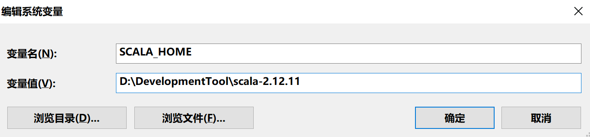
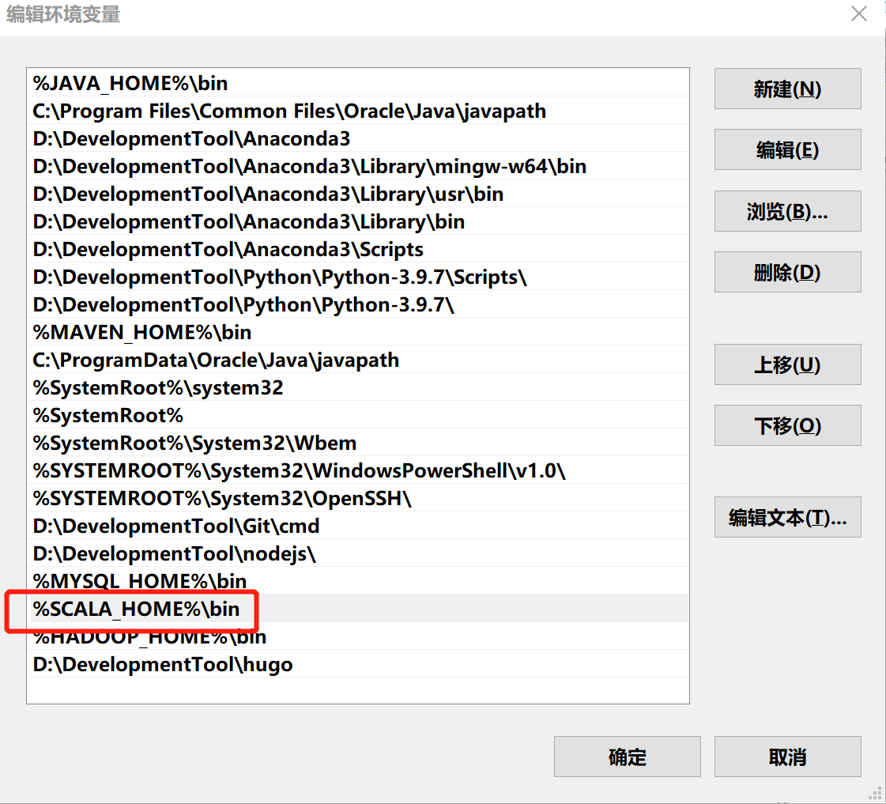
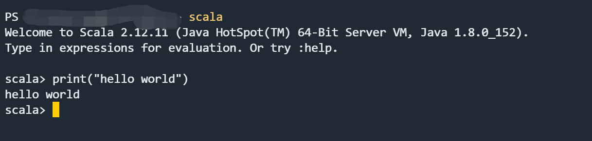
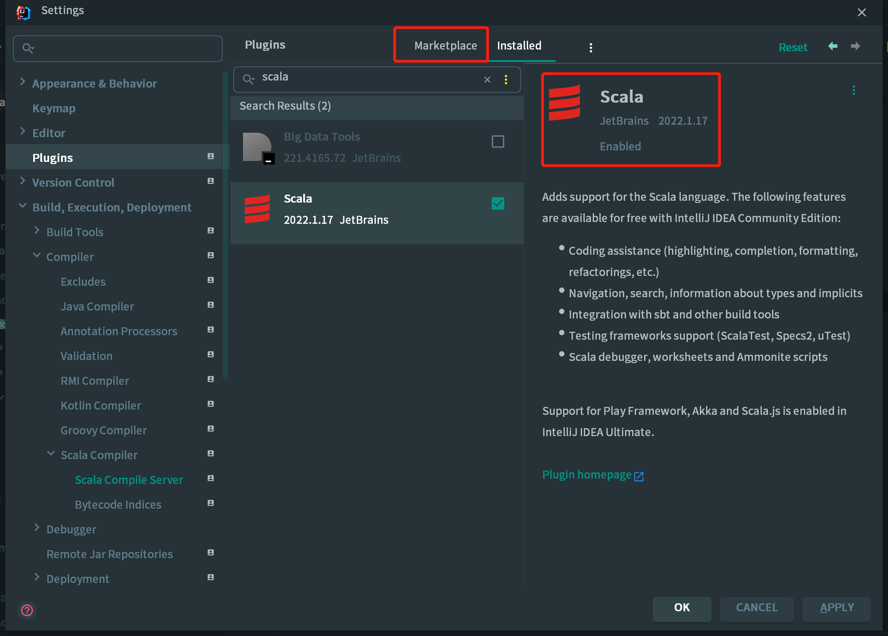
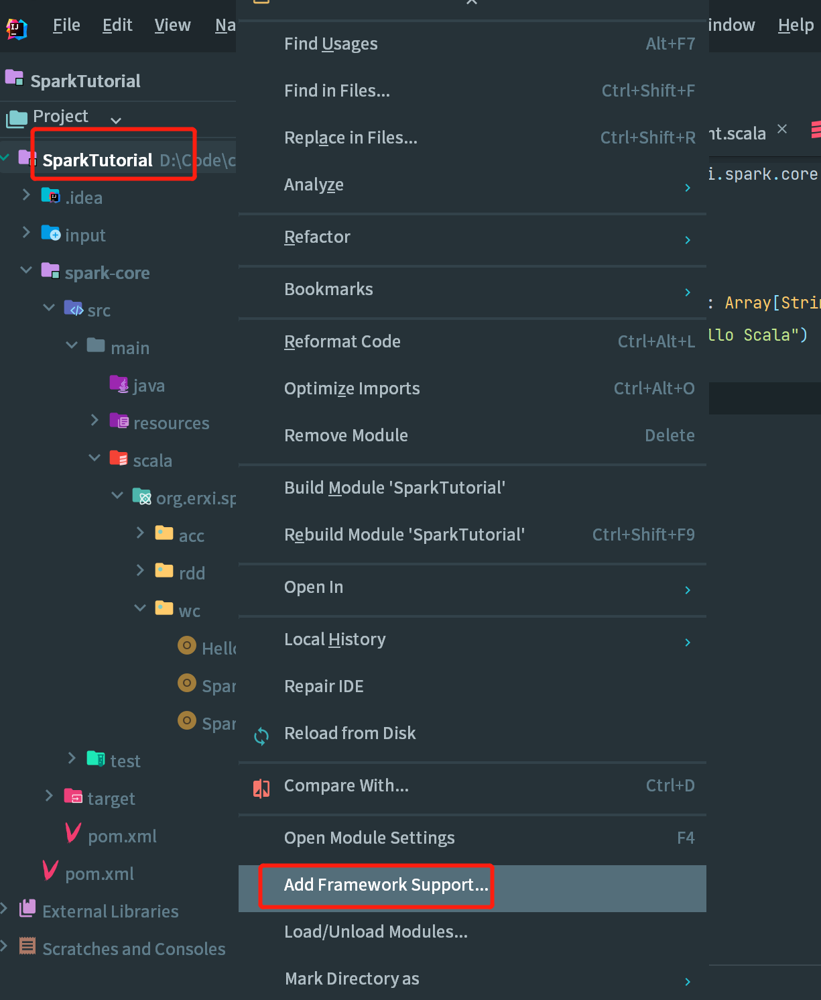
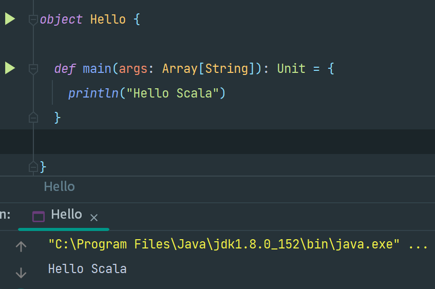
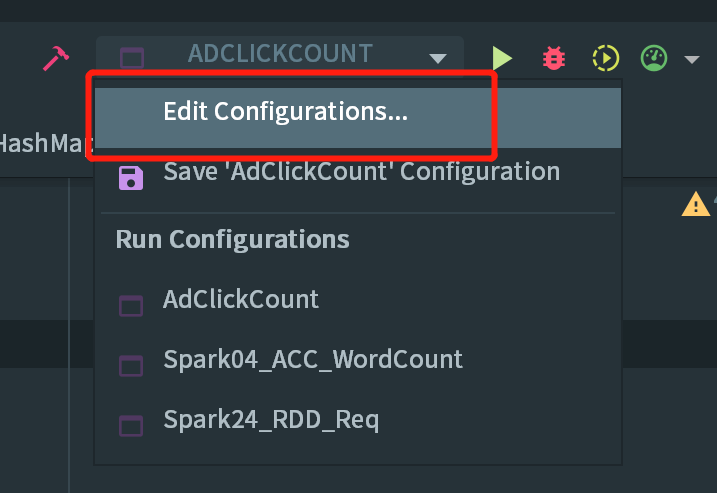
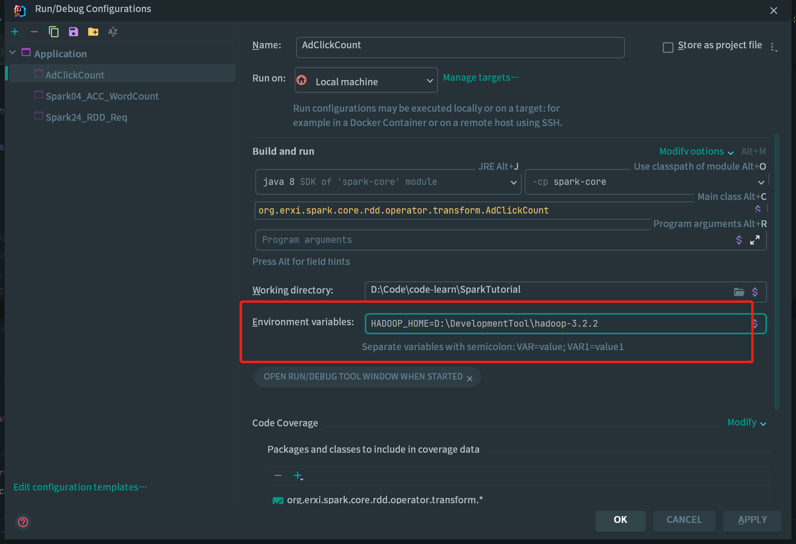

# Windows 配置 Scala 开发环境

## 零、前言

谈起现如今的大数据开发框架，那么 Spark 想必是众所周知的。而 Spark 就是使用 Scala 语言编写的。所以问题来了，该如何配置一套 Scala 的环境呢？

其实，有了 Java 的底子之后，配置一套 Scala 开发环境并不是很难，因为 Scala 一门以 JVM 为运行环境并将面向对象和函数式编程的最佳特性结合在一起的
静态类型编程语言，支持面向对象和函数式编程。

## 一、Scala 环境搭建

前文提到，Scala 是运行在 JVM 上的，所以首先先保证开发环境已经配置了 JDK，这里不做过多赘述。（我使用的 JDK1.8）

1.下载所需要的 Scala 版本，[download](https://www.scala-lang.org/download/)；

2.将下载好的 zip 文件压解至无中文的目录下，最好也不要有空格；

3.打开 Windows 的系统属性中的环境变量，配置 Scala 的环境变量：`SCALA_HOME` 以及所属目录：`D:\DevelopmentTool\scala-2.12.11`



配置 path 路径，将 bin 目录添加至系统环境 `%SCALA_HOME%\bin`



4.测试

打开 terminal 终端，输入 scala 出现如下图所示表示配置好环境~~



## 二、在 IDEA 中配置 Scala 开发环境

IDEA 懂的都懂 好用就完事了！！！下面将演示如何在 IDEA 集成 Scala 开发环境。

1.在 Setting 的 plugins 中搜素 Scala ->点击 Install->点击 ok->点击 apply，重启 IDEA；



2.创建一个 projet，默认是不支持 Scala 的开发。需要手动引入 Scala 框架，在项目上，点击右键-> Add Framework Support... ->选择 Scala->点击 OK。



*注意：如果是第一次引入框架，Use libary 看不到，需要选择你的 Scala 安装目录，然后工具就会自动识别，就会显示 user libary。*

3.测试



以上我们已经完成了 Scala 的开发环境，可以完成一些基础的相关。

## 三、配置 Spark 开发环境

1.创建 Spark 项目，添加相关依赖：

```
<dependency>
    <groupId>org.apache.spark</groupId>
    <artifactId>spark-core_2.12</artifactId>
    <version>3.0.0</version>
</dependency>
```

添加依赖之后，就可以使用 Spark 相关的 API，但是在运行过程中，控制台可以会出现一些神奇的错误，如下所示：

```
ERROR Shell: Failed to locate the winutils binary in the hadoop binary path
java.io.IOException: Could not locate executable null\bin\winutils.exe in the Hadoop binaries.
	at org.apache.hadoop.util.Shell.getQualifiedBinPath(Shell.java:382)
	at org.apache.hadoop.util.Shell.getWinUtilsPath(Shell.java:397)
	at org.apache.hadoop.util.Shell.<clinit>(Shell.java:390)
	at org.apache.hadoop.util.StringUtils.<clinit>(StringUtils.java:80)
	at org.apache.hadoop.security.SecurityUtil.getAuthenticationMethod(SecurityUtil.java:611)
	at org.apache.hadoop.security.UserGroupInformation.initialize(UserGroupInformation.java:274)
	at org.apache.hadoop.security.UserGroupInformation.ensureInitialized(UserGroupInformation.java:262)
	at org.apache.hadoop.security.UserGroupInformation.loginUserFromSubject(UserGroupInformation.java:807)
	at org.apache.hadoop.security.UserGroupInformation.getLoginUser(UserGroupInformation.java:777)
	at org.apache.hadoop.security.UserGroupInformation.getCurrentUser(UserGroupInformation.java:650)
	at org.apache.spark.util.Utils$.$anonfun$getCurrentUserName$1(Utils.scala:2412)
	at scala.Option.getOrElse(Option.scala:189)
	at org.apache.spark.util.Utils$.getCurrentUserName(Utils.scala:2412)
	at org.apache.spark.SparkContext.<init>(SparkContext.scala:303)
	at org.erxi.spark.core.rdd.operator.transform.AdClickCount$.main(AdClickCount.scala:8)
	at org.erxi.spark.core.rdd.operator.transform.AdClickCount.main(AdClickCount.scala)
```

这是因为在程序中使用了 Hadoop 相关的内容，比如写入文件到 HDFS。出现这个问题并不是程序的错误，而是windows 系统用到了 hadoop 相关的服务，解决办法是通过配置关联到 windows 的系统依赖就可以了。

## 2.解决异常

安装 Spark：到官网 https://spark.apache.org/downloads.html 选择合适的版本下载，注意 Spark 与Hadoop 版本选择要相对应，建议下载预编译（Pre-built）好的版本，省得麻烦。解压文件，然后与配置 Scala 环境类似配置对应的 `SPARK_HOME` 与 path 变量 `%SPARK_HOME%\bin`;

安装 Hadoop：到官网 https://hadoop.apache.org/releases.html 下载与上边的 Spark 对应的版本。后与配置 Scala 环境类似配置对应的 `HADOOP_HOME` 与 path 变量 `%HADOOP_HOME%\bin`。

除此之外，还需要到这里 https://github.com/cdarlint/winutils 下载对应版本的 bin 目录中的 hadoop.dll 和 winutils.exe，复制到 hadoop 目录的 bin 目录下。

完成上述操作之后，已经在 Windows 环境下搭建了可用于测试的 Spark 环境和 Hadoop 环境。最后还需要再 IDEA 中导入一下 HADOOP_HOME，这样运行程序就不会报错啦~~

在 IDEA 中配置 Run Configuration，添加 HADOOP_HOME 变量：




