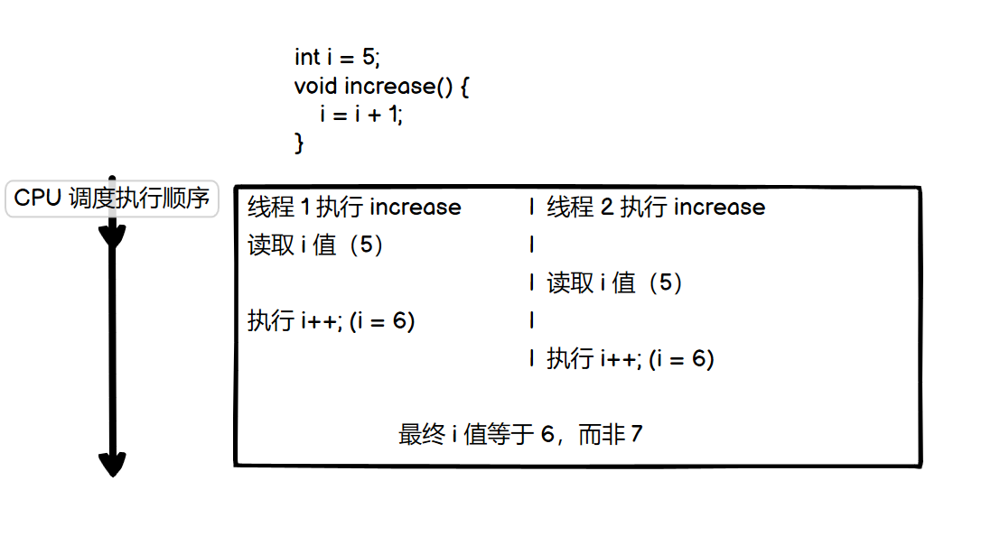
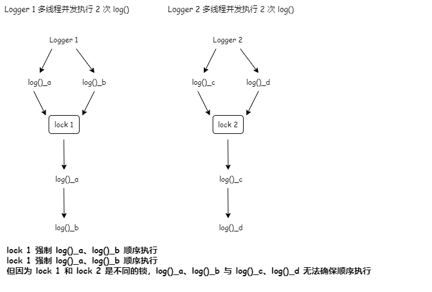

## 单例模式

### 为什么使用单例模式？

**单例设计模式**：一个类只允许创建一个对象（或者实例），那么这个类就是一个单例类，这种设计模式就叫做单例设计模式，简称单例模式。

单例模式的概念并不是很难，一看就能明白。接下来我们思考一下，为什么需要单例这种设计模式？它能解决哪些问题？

### 实战案例：处理资源访问冲突

咱们先来看第一个例子。该例子中，我们自定义实现了一个往文件中打印日志的 Logger 类。具体的实现代码如下：

```java
public class Logger {
  private FileWriter writer;
  
  public Logger() {
    File file = new File("/Users/zhangsan/log.txt");
    writer = new FileWriter(file, true); // true表示追加写入
  }
  
  public void log(String message) {
    writer.write(message);
  }
}

// Logger类的应用示例：
public class UserController {
  private Logger logger = new Logger();
  
  public void login(String username, String password) {
    // ...省略业务逻辑代码...
    logger.log(username + " logined!");
  }
}

public class OrderController {
  private Logger logger = new Logger();
  
  public void create(OrderVo order) {
    // ...省略业务逻辑代码...
    logger.log("Created an order: " + order.toString());
  }
}
```

上述代码的功能并不是很复杂，但请停下来思考一下，这段代码存在什么问题。

细心的同学可能已经注意到了，所有的日子都写入到同一个文件 `/Users/zhangsan/log.txt` 中。在 UserController 和 OrderController 中，分别创建了两个 Logger 对象。在 Web 容器的 Servlet 多线程环境下，如果两个 Servlet 线程同时分别执行 login() 和 create() 两个函数，并且同时写日子到 log.txt 文件中，那么就有可能存在日子信息相互覆盖的情况。

为什么会出现相互覆盖呢？可以这样类比着理解。在多线程环境下，如果两个线程同时给同一个共享变量加 1，因为共享变量是竞争资源，所以，共享变量最后的结果有可能并不是加 2，而是只加了 1。同理，这里的 log.txt 文件也是竞争资源，两个线程同时往里面写数据，就有可能会存在相互覆盖的情况。



那么该如何来解决和这个问题呢？通常的思路应该是加锁：给 log() 函数加互斥锁（Java 中可以通过 synchronized 的关键字），同一时刻只允许一个线程调用 log() 函数。具体的代码实现如下：

```java
public class Logger {
  private FileWriter writer;

  public Logger() {
    File file = new File("/Users/zhangsan/log.txt");
    writer = new FileWriter(file, true); // true表示追加写入
  }
  
  public void log(String message) {
    synchronized(this) {
      writer.write(mesasge);
    }
  }
}
```

不过，仔细思考一下，这真的能解决多线程写入日志时相互覆盖的问题吗？答案是否定的！这是因为这种锁是一个对象级别的锁，一个对象在不同的线程下同时调用 log() 函数，会被强制要求顺序执行。但是，不同的对象之间并不能共享同一把锁。在不同的线程下，通过不同的对象调用执行 log() 函数，锁并不会起作用，任然有可能存在写入日志相互覆盖的问题。



这里稍微补充一下，在刚刚的讲解和给出代码的中，故意“隐藏”了一个事实：我们给 log() 函数加不加对象级别的锁，其实都没有关系。因为 FileWriter 本身就是现场安全的，它的内部实现中本身就假了对象级别的锁，因此，在外层调用 write() 函数的时候，再加对象级别的锁实际上是多此一举。因为不同的 Logger 对象不共享 FileWriter 对象，所以 FileWriter 对象级别的锁也解决不了数据写入相互覆盖的问题。

那么问题来了，该如何解决呢？实际上，要解决这个问题并不是很难。我们只需要吧对象级别的锁换成类级别的锁就可以了。让所有的对象都共享同一把锁。这样就避免了不同对象之间同时调用 log() 函数，而导致的日志覆盖的问题。具体的代码实现如下所示：

```java
public class Logger {
  private FileWriter writer;

  public Logger() {
    File file = new File("/Users/zhangsan/log.txt");
    writer = new FileWriter(file, true); // true表示追加写入
  }
  
  public void log(String message) {
    synchronized(Logger.class) { // 类级别的锁
      writer.write(mesasge);
    }
  }
}
```

除了使用类级别锁之外，实际上，解决资源竞争问题的办法还有很多，分布式锁是最常听到的一种解决方案。不过，实现一个安全可靠、无 bug、高性能的分布式锁，并不是件容易的事情。除此之外，并发队列（比如 Java 中的 BlockingQueue）也可以解决这个问题：多个线程同时往并发队列里写日志，一个单独的线程负责将并发队列中的数据，写入到日志文件。这种方式实现起来也稍微有点复杂。

相对于这两种解决方案，单例模式的解决思路就简单一些了。单例模式相对于之前类级别锁的好处是，不用创建那么多 Logger 对象，一方面节省内存空间，另一方面节省系统文件句柄（对于操作系统来说，文件句柄也是一种资源，不能随便浪费）。

我们将 Logger 设计成一个单例类，程序中只允许创建一个 Logger 对象，所有的线程共享使用的这一个 Logger 对象，共享一个 FileWriter 对象，而 FileWriter 本身是对象级别线程安全的，也就避免了多线程情况下写日志会互相覆盖的问题。

按照这个设计思路，我们实现了 Logger 单例类。具体代码如下所示：

```java
public class Logger {
  private FileWriter writer;
  private static final Logger instance = new Logger();

  private Logger() {
    File file = new File("/Users/shangsan/log.txt");
    writer = new FileWriter(file, true); // true表示追加写入
  }
  
  public static Logger getInstance() {
    return instance;
  }
  
  public void log(String message) {
    writer.write(mesasge);
  }
}

// Logger类的应用示例：
public class UserController {
  public void login(String username, String password) {
    // ...省略业务逻辑代码...
    Logger.getInstance().log(username + " logined!");
  }
}

public class OrderController {  
  public void create(OrderVo order) {
    // ...省略业务逻辑代码...
    Logger.getInstance().log("Created a order: " + order.toString());
  }
}
```

### 实战案例二：表示全局唯一类

从业务概念上，如果有些数据在系统中只应保持一份，那就适合设计为单例类。

比如，配置信息类。在系统中，我们只有一个配置文件，当配置文件被加载到内存后，以对象的形式存在，也理所应当只有一份。

再比如，唯一递增 ID 号码生成器，如果程序中有两个对象，就会存在生成重复 ID 的情况，所以我们应该将 ID 生成器类设计为单例。

```java
import java.util.concurrent.atomic.AtomicLong;

public class IdGenerator {
  // AtomicLong 是一个 Java 并发库中提供的一个原子变量类型,
  // 它将一些线程不安全需要加锁的复合操作封装为了线程安全的原子操作，
  // 比如下面会用到的 incrementAndGet().
  private AtomicLong id = new AtomicLong(0);
  private static final IdGenerator instance = new IdGenerator();
  private IdGenerator() {}
  public static IdGenerator getInstance() {
    return instance;
  }
  public long getId() { 
    return id.incrementAndGet();
  }
}

// IdGenerator 使用举例
long id = IdGenerator.getInstance().getId();
```

### 如何实现一个单例？

概括起来，要实现一个单例，我们需要关注的无外乎下面几个：

-    构造函数需要是 private 访问权限的，这样才能避免外部通过 new 创建实例；
-    考虑对象创建时的线程安全问题；
-    考虑是否支持延迟加载；
-    考虑 getInstance() 是否加锁（性能是否高）。

#### 1. 饿汉式

饿汉式的实现方式比较简单。在类加载的时候，instance 静态实例就已经创建并初始化好了，所以 instance 实例的创建过程是线程安全的。不过，这样的实现方式不支持延迟加载（在真正用到 IdGenerator 的时候，再创建实例），从名字中我们也可以看出这一点。具体的代码实现如下所示：

```java
public class IdGenerator { 
  private AtomicLong id = new AtomicLong(0);
  private static final IdGenerator instance = new IdGenerator();
  private IdGenerator() {}
  public static IdGenerator getInstance() {
    return instance;
  }
  public long getId() { 
    return id.incrementAndGet();
  }
}
```

有人觉得这种实现方式不好，因为不支持延迟加载，如果实例占用资源多（比如占用内存多）或初始化耗时长（比如需要加载各种配置文件），提前初始化实例是一种浪费资源的行为。最好的方法应该在用到的时候再去初始化。不过，从我的角度来说，并不是很认同这种观点。

如果初始化耗时长，那我们最好不要等到真正要用它的时候，才去执行这个耗时长的初始化过程，这会影响到系统的性能（比如，在响应客户端接口请求的时候，做这个初始化操作，会导致此请求的响应时间变长，甚至超时）。采用饿汉式实现方式，将耗时的初始化操作，提前到程序启动的时候完成，这样就能避免在程序运行的时候，再去初始化导致的性能问题。

如果实例占用资源多，按照 fail-fast 的设计原则（有问题及早暴露），那我们也希望在程序启动时就将这个实例初始化好。如果资源不够，就会在程序启动的时候触发报错（比如 Java 中的 PermGen Space OOM），我们可以立即去修复。这样也能避免在程序运行一段时间后，突然因为初始化这个实例占用资源过多，导致系统崩溃，影响系统的可用性。

#### 2. 懒汉式

有饿汉式，对应的，就有懒汉式。懒汉式相对于饿汉式的优势是支持延迟加载。具体的代码实现如下所示：

```java
public class IdGenerator { 
  private AtomicLong id = new AtomicLong(0);
  private static IdGenerator instance;
  private IdGenerator() {}
  public static synchronized IdGenerator getInstance() {
    if (instance == null) {
      instance = new IdGenerator();
    }
    return instance;
  }
  public long getId() { 
    return id.incrementAndGet();
  }
}
```

不过懒汉式的缺点也很明显，我们给 getInstance() 这个方法加了一把大锁（synchronzed），导致这个函数的并发度很低。量化一下的话，并发度是 1，也就相当于串行操作了。而这个函数是在单例使用期间，一直会被调用。如果这个单例类偶尔会被用到，那这种实现方式还可以接受。但是，如果频繁地用到，那频繁加锁、释放锁及并发度低等问题，会导致性能瓶颈，这种实现方式就不可取了。

#### 3. 双重检测

饿汉式不支持延迟加载，懒汉式有性能问题，不支持高并发。那我们再来看一种既支持延迟加载、又支持高并发的单例实现方式，也就是双重检测实现方式。

在这种实现方式中，只要 instance 被创建之后，即便再调用 getInstance() 函数也不会再进入到加锁逻辑中了。所以，这种实现方式解决了懒汉式并发度低的问题。具体的代码实现如下所示：

```java
public class IdGenerator { 
  private AtomicLong id = new AtomicLong(0);
  private static IdGenerator instance;
  private IdGenerator() {}
  public static IdGenerator getInstance() {
    if (instance == null) {
      synchronized(IdGenerator.class) { // 此处为类级别的锁
        if (instance == null) {
          instance = new IdGenerator();
        }
      }
    }
    return instance;
  }
  public long getId() { 
    return id.incrementAndGet();
  }
}
```

网上有人说，这种实现方式有些问题。因为指令重排序，可能会导致 IdGenerator 对象被 new 出来，并且赋值给 instance 之后，还没来得及初始化（执行构造函数中的代码逻辑），就被另一个线程使用了。

要解决这个问题，我们需要给 instance 成员变量加上 volatile 关键字，禁止指令重排序才行。实际上，只有很低版本的 Java 才会有这个问题。我们现在用的高版本的 Java 已经在 JDK 内部实现中解决了这个问题（解决的方法很简单，只要把对象 new 操作和初始化操作设计为原子操作，就自然能禁止重排序）。关于这点的详细解释，跟特定语言有关，我就不展开讲了，感兴趣的同学可以自行研究一下。

#### 4. 静态内部类

我们再来看一种比双重检测更加简单的实现方法，那就是利用 Java 的静态内部类。它有点类似饿汉式，但又能做到了延迟加载。具体是怎么做到的呢？我们先来看它的代码实现。

```java
public class IdGenerator { 
  private AtomicLong id = new AtomicLong(0);
  private IdGenerator() {}

  private static class SingletonHolder{
    private static final IdGenerator instance = new IdGenerator();
  }
  
  public static IdGenerator getInstance() {
    return SingletonHolder.instance;
  }
 
  public long getId() { 
    return id.incrementAndGet();
  }
}
```

SingletonHolder 是一个静态内部类，当外部类 IdGenerator 被加载的时候，并不会创建 SingletonHolder 实例对象。只有当调用 getInstance() 方法时，SingletonHolder 才会被加载，这个时候才会创建 instance。instance 的唯一性、创建过程的线程安全性，都由 JVM 来保证。所以，这种实现方法既保证了线程安全，又能做到延迟加载。

#### 5. 枚举

最后，我们介绍一种最简单的实现方式，基于枚举类型的单例实现。这种实现方式通过 Java 枚举类型本身的特性，保证了实例创建的线程安全性和实例的唯一性。具体的代码如下所示：

```java
public enum IdGenerator {
  INSTANCE;
  private AtomicLong id = new AtomicLong(0);
 
  public long getId() { 
    return id.incrementAndGet();
  }
}
```

### 重点回顾

#### 1. 单例的定义

单例设计模式（Singleton Design Pattern）理解起来非常简单。一个类只允许创建一个对象（或者叫实例），那这个类就是一个单例类，这种设计模式就叫作单例设计模式，简称单例模式。

#### 2. 单例的用处

从业务概念上，有些数据在系统中只应该保存一份，就比较适合设计为单例类。比如，系统的配置信息类。除此之外，我们还可以使用单例解决资源访问冲突的问题。

#### 3. 单例的实现

单例有下面几种经典的实现方式。

-    饿汉式

饿汉式的实现方式，在类加载的期间，就已经将 instance 静态实例初始化好了，所以，instance 实例的创建是线程安全的。不过，这样的实现方式不支持延迟加载实例。

-    懒汉式

懒汉式相对于饿汉式的优势是支持延迟加载。这种实现方式会导致频繁加锁、释放锁，以及并发度低等问题，频繁的调用会产生性能瓶颈。

-    双重检测

双重检测实现方式既支持延迟加载、又支持高并发的单例实现方式。只要 instance 被创建之后，再调用 getInstance() 函数都不会进入到加锁逻辑中。所以，这种实现方式解决了懒汉式并发度低的问题。

-    静态内部类

利用 Java 的静态内部类来实现单例。这种实现方式，既支持延迟加载，也支持高并发，实现起来也比双重检测简单。

-    枚举

最简单的实现方式，基于枚举类型的单例实现。这种实现方式通过 Java 枚举类型本身的特性，保证了实例创建的线程安全性和实例的唯一性。

