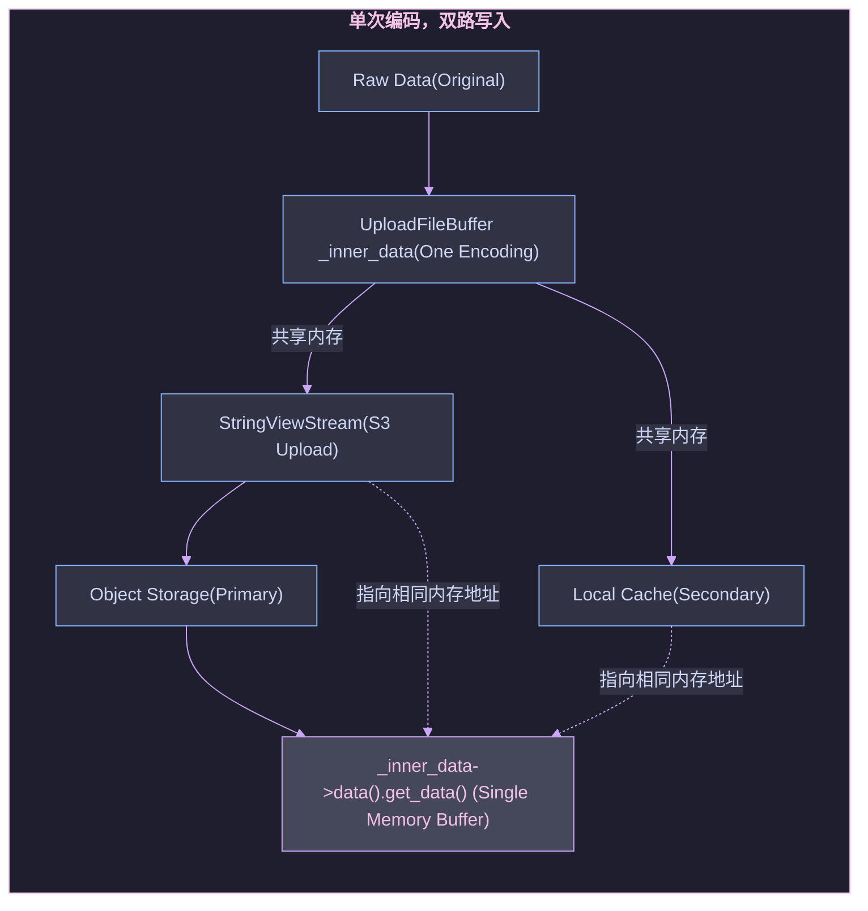

# Cluade Code 食用指北：存算分离写入的一点杂记

## 背景

最近接触 Doris 存算分离的场景比较多，在存算分离架构中，计算与存储资源不再是耦合在一起，通常是把数据持久化在**对象存储**中，而非 BE 节点本地。BE 节点专注于查询计算，仅**缓存**热数据，无需管理底层存储。这种架构实现了存储和计算资源的独立扩缩容，降低了总拥有成本，同时通过多层缓存机制保证了查询性能。

这么一看存算分离的优点很明确，但最近在使用的过程中，遇见一个问题，那就是数据既然是直接存在对象存储中，但为什么当有大量数据写入的时候，BE 节点的 IO 会很高，甚至达到瓶颈。大概率猜到是写入本地缓存的原因导致，但具体是先写入本地缓存，还是先写入对象存储，一直比较模糊，所以想借助 Claude Code 分析源码来一探究竟。

## Doris 存算分离写入流程源码分析

Doris 这里我们选用最新的 3.0.6.2 版本，进行分析，打开 Terminal 输入：

```sh
# 克隆 Doris 源码
$ git clone https://github.com/apache/doris.git

# 进入源码目录
$ cd doris

# 切换到 3.0.6.2 版本
$ git checkout 3.0.6.2

# claude code 分析
$ claude
```

启动 Claude Code 之后，输入 `/help` 查看帮助文档，如下图所示：


发现还有 `/vim` 命令，可以进入 vim 模式，狂喜！

Doris 的导入方式有很多，这里我们选用 `Stream Load` 的方式来看看一个完整的写入流程，输入 prompt 如下：

```prompt
结合源码，分析 doris 存算分离模式下，完整的写入流程。务必详细准确，你要做的就是分析源码，不用过多展开延伸。使用自然段通顺连贯地表达。必要时可以给出核心代码进行说明，并展示代码来源。
```

会发现 Claude Code 会把输入的“人话”解析为 TODOS，进行逐步执行，可以很直观的看见拆分的任务是否合理。


> 下文基于 Claude Code 输出，进行整理得到。

### 写入流程

Doris 存算分离模式完整写入流程：

```bash
  ┌────────────────────────────────────────────────────────────────────────────┐
  │                                  FE (Frontend)                             │
  │  ┌─────────────────┐      ┌─────────────────┐      ┌─────────────────┐     │
  │  │ Stream Load     │────▶ │ Transaction     │────▶ │ Meta Service    │     │
  │  │ Request         │      │ Manager         │      │ (Cloud)         │     │
  │  └─────────────────┘      └─────────────────┘      └─────────────────┘     │
  └────────────────────────────────────────────────────────────────────────────┘
                                      │
                                      ▼
  ┌────────────────────────────────────────────────────────────────────────────┐
  │                                BE (Backend)                                │
  │                                                                            │
  │  ┌─────────────────┐      ┌─────────────────┐      ┌─────────────────┐     │
  │  │CloudStreamLoad  │────▶ │StreamLoadContext│────▶ │CloudDeltaWriter │     │
  │  │Executor         │      │                 │      │                 │     │
  │  └─────────────────┘      └─────────────────┘      └─────────────────┘     │
  │                                                           │                │
  │                                                           ▼                │
  │  ┌─────────────────┐      ┌─────────────────┐      ┌─────────────────┐     │
  │  │MemTableWriter   │◀─────│    MemTable     │◀─────│   Data Block    │     │
  │  │                 │      │ (Memory Buffer) │      │   (Incoming)    │     │
  │  └─────────────────┘      └─────────────────┘      └─────────────────┘     │
  │           │                                                                │
  │           ▼                                                                │
  │  ┌─────────────────┐      ┌─────────────────┐     ┌─────────────────┐      │
  │  │   CloudRowset   │────▶ │   CloudRowset   │────▶│ Segment Writer  │      │
  │  │     Builder     │      │     Writer      │     │                 │      │
  │  └─────────────────┘      └─────────────────┘     └─────────────────┘      │
  │                                                           │                │
  │                                                           ▼                │
  │  ┌─────────────────┐      ┌─────────────────┐      ┌─────────────────┐     │
  │  │  S3FileWriter   │◀─────│  File Writer    │◀─────│   Segment Data  │     │
  │  │                 │      │    Creator      │      │                 │     │
  │  └─────────────────┘      └─────────────────┘      └─────────────────┘     │
  │           │                                                                │
  └───────────│────────────────────────────────────────────────────────────────┘
              │
              ▼
  ┌────────────────────────────────────────────────────────────────────────────┐
  │                         Object Storage (S3/OSS/COS)                        │
  │                                                                            │
  │  ┌─────────────────┐      ┌─────────────────┐      ┌─────────────────┐     │
  │  │ .dat Files      │      │ .idx Files      │      │ .hdr Files      │     │
  │  │ (Data Segments) │      │ (Index Files)   │      │ (Headers)       │     │
  │  └─────────────────┘      └─────────────────┘      └─────────────────┘     │
  └────────────────────────────────────────────────────────────────────────────┘
              │
              ▼ (Async)
  ┌────────────────────────────────────────────────────────────────────────────┐
  │                            Local File Cache                                │
  │                                                                            │
  │  ┌─────────────────┐      ┌─────────────────┐      ┌─────────────────┐     │
  │  │ Cache Blocks    │      │ Warm Up Manager │      │ Cache Metadata  │     │
  │  │ (Hot Data)      │      │ (Preload)       │      │                 │     │
  │  └─────────────────┘      └─────────────────┘      └─────────────────┘     │
  └────────────────────────────────────────────────────────────────────────────┘
```

#### 1. 写入请求处理阶段

Stream Load 请求首先到达 FE，FE 分配事务 ID 并选择适当的 BE 节点。BE 端的 CloudStreamLoadExecutor 作为存算分离模式的专用执行器接管了请求，处理写入逻辑。它继承自通用的 StreamLoadExecutor，但针对云环境进行了特殊优化。

```cpp
  Status CloudStreamLoadExecutor::pre_commit_txn(StreamLoadContext* ctx) {
      auto st = _exec_env->storage_engine().to_cloud().meta_mgr().precommit_txn(*ctx);
      if (!st.ok()) {
          LOG(WARNING) << "Failed to precommit txn: " << st << ", " << ctx->brief();
          return st;
      }
      ctx->need_rollback = false;
      return st;
  }
```

#### 2. 数据写入内存阶段

数据写入的核心环节由 CloudDeltaWriter 负责，它管理整个数据从内存到持久化的流程。数据首先进入 MemtableWriter 管理的内存缓冲区。这么设计的好处是，写入操作能够快速响应，不受磁盘 I/O 的限制。

```cpp
  Status CloudDeltaWriter::write(const vectorized::Block* block,
                                 const std::vector<uint32_t>& row_idxs) {
      if (row_idxs.empty()) [[unlikely]] {
          return Status::OK();
      }
      std::lock_guard lock(_mtx);
      CHECK(_is_init || _is_cancelled);
      {
          SCOPED_TIMER(_wait_flush_limit_timer);
          while (_memtable_writer->flush_running_count() >=
                 config::memtable_flush_running_count_limit) {
              std::this_thread::sleep_for(std::chrono::milliseconds(10));
          }
      }
      return _memtable_writer->write(block, row_idxs);
  }
```

MemtableWriter 负责将数据写入 MemTable，当 MemTable 的数据达到预设阈值时，系统会触发异步 flush 操作，避免内存占用过高。可以通过在 be.conf 中配置 [memtable_flush_running_count_limit](https://github.com/apache/doris/blob/branch-3.0.6/be/src/common/config.h#L717)，`memtable_flush_running_count_limit` 是控制每个 MemtableWriter 可以同时运行的最大并行 flush 任务数。根据生产经验，一般来说保持默认值就好。

```cpp
  Status MemTableWriter::write(const vectorized::Block* block,
                               const std::vector<uint32_t>& row_idxs) {
      // ... 锁定和状态检查 ...
      _total_received_rows += row_idxs.size();
      auto st = _mem_table->insert(block, row_idxs);

      if (!st.ok()) [[unlikely]] {
          _reset_mem_table();
          return st;
      }

      if (UNLIKELY(_mem_table->need_flush())) {
          auto s = _flush_memtable_async();
          _reset_mem_table();
          if (UNLIKELY(!s.ok())) {
              return s;
          }
      }
      return Status::OK();
  }
```

#### 3. Rowset 构建阶段

CloudRowsetBuilder 负责初始化和构建 rowset，它会同步 tablet 的 rowset 信息，并为 MoW（Merge-on-Write）表初始化相应的上下文。这一步骤为后续的持久化操作做好准备，确保元数据的一致性。

```cpp
  Status CloudRowsetBuilder::init() {
      _tablet = DORIS_TRY(_engine.get_tablet(_req.tablet_id));

      std::shared_ptr<MowContext> mow_context;
      if (_tablet->enable_unique_key_merge_on_write()) {
          auto st = std::static_pointer_cast<CloudTablet>(_tablet)->sync_rowsets();
          if (!st.ok() && !st.is<ErrorCode::INVALID_TABLET_STATE>()) {
              return st;
          }
          RETURN_IF_ERROR(init_mow_context(mow_context));
      }
      // ... 构建 rowset writer context ...
      context.storage_resource = _engine.get_storage_resource(_req.storage_vault_id);
      context.write_file_cache = _req.write_file_cache;
      context.file_cache_ttl_sec = _tablet->ttl_seconds();

      _rowset_writer = DORIS_TRY(_tablet->create_rowset_writer(context, false));
      return Status::OK();
  }
```

#### 4. 数据持久化阶段

CloudRowsetWriter 负责将数据写入持久化存储，它会设置远程存储资源信息，并根据是否为部分更新决定 rowset 状态。

```cpp
  Status CloudRowsetWriter::init(const RowsetWriterContext& rowset_writer_context) {
      _context = rowset_writer_context;
      _rowset_meta = std::make_shared<RowsetMeta>();

      if (_context.is_local_rowset()) {
          _context.tablet_path = io::FileCacheFactory::instance()->pick_one_cache_path();
      } else {
          _rowset_meta->set_remote_storage_resource(*_context.storage_resource);
      }
      // ... 设置 rowset meta 信息 ...
      _context.segment_collector =
  std::make_shared<SegmentCollectorT<BaseBetaRowsetWriter>>(this);
      _context.file_writer_creator =
      std::make_shared<FileWriterCreatorT<BaseBetaRowsetWriter>>(this);
      return Status::OK();
  }
```

#### 5. 对象存储写入阶段

在对象存储写入阶段，S3FileWriter 是整个写入链路的终点，负责将数据实际写入对象存储。它支持多种写入模式，针对不同大小的文件采用不同的上传策略 — 小文件直接上传，大文件则采用分片上传。这种灵活的机制确保了数据写入的效率和可靠性。

```cpp
  Status S3FileWriter::appendv(const Slice* data, size_t data_cnt) {
      if (state() != State::OPENED) [[unlikely]] {
          return Status::InternalError("append to closed file: {}",
                                       _obj_storage_path_opts.path.native());
      }

      size_t buffer_size = config::s3_write_buffer_size;
      for (size_t i = 0; i < data_cnt; i++) {
          // ... 数据写入逻辑 ...
          if (_pending_buf->get_size() == buffer_size) {
              if (_cur_part_num == 1) {
                  RETURN_IF_ERROR(_create_multi_upload_request());
              }
              _cur_part_num++;
              _countdown_event.add_count();
              RETURN_IF_ERROR(FileBuffer::submit(std::move(_pending_buf)));
              _pending_buf = nullptr;
          }
          _bytes_appended += data_size_to_append;
      }
      return Status::OK();
  }
```

#### 6. 本地缓存机制

存算分离模式的一个关键特性是支持本地缓存，通过 FileCacheAllocatorBuilder 管理缓存分配。系统会将热数据异步写入本地缓存，提高后续查询的性能。

```cpp
  if (config::enable_file_cache && opts != nullptr && opts->write_file_cache) {
      _cache_builder = std::make_unique<FileCacheAllocatorBuilder>(FileCacheAllocatorBuilder {
              opts ? opts->is_cold_data : false, opts ? opts->file_cache_expiration : 0,
              BlockFileCache::hash(_obj_storage_path_opts.path.filename().native()),
              FileCacheFactory::instance()->get_by_path(
                      BlockFileCache::hash(_obj_storage_path_opts.path.filename().native()))});
  }
```

#### 7. 事务提交阶段

最后，CloudStreamLoadExecutor 负责事务的提交。根据表类型和系统配置，它会决定是在 BE 直接提交还是通过 FE 提交。对于 MoW 表，系统采用了支持重试机制的提交策略，提高了事务的成功率。

```cpp
  Status CloudStreamLoadExecutor::commit_txn(StreamLoadContext* ctx) {
      if (ctx->is_mow_table() || !config::enable_stream_load_commit_txn_on_be ||
          ctx->load_type == TLoadType::ROUTINE_LOAD) {
          // 对于 MoW 表，通过 FE 提交，支持重试机制
          Status st;
          int retry_times = 0;
          while (retry_times < config::mow_stream_load_commit_retry_times) {
              st = StreamLoadExecutor::commit_txn(ctx);
              if (st.ok() || !st.is<ErrorCode::DELETE_BITMAP_LOCK_ERROR>()) {
                  break;
              }
              retry_times++;
              stream_load_commit_retry_counter << 1;
          }
          return st;
      }
      // 直接在 BE 提交
      auto st = _exec_env->storage_engine().to_cloud().meta_mgr().commit_txn(*ctx, false);
      if (!st.ok()) {
          LOG(WARNING) << "Failed to commit txn: " << st << ", " << ctx->brief();
          return st;
      }
      ctx->need_rollback = false;
      return st;
  }
```

总的来说，Doris 存算分离模式的写入流程主要是以下几个阶段：

首先，Stream Load 请求由 FE 接收并分配事务 ID，随后交由 BE 节点的 CloudStreamLoadExecutor 处理；其次，数据通过 CloudDeltaWriter 写入 MemTable 内存缓冲区，当缓冲区达到阈值时触发异步 flush；接着，数据由 CloudRowsetBuilder 和 CloudRowsetWriter 构建并组织成持久化格式；最终通过 S3FileWriter 直接写入对象存储，然后异步写入本地缓存。

本来写到这里以为可以结束，毕竟得到了一个比较笼统的结论：*Doris 在写入数据的时候，会直接写入对象存储，然后异步写入本地缓存*。比较巧的是，这周和同事们讨论到 TSDB 相关的内容，其中就有提到“数据高吞吐实时写入”。然后就找 WayneXia（AKA 大师）聊聊，在 GreptimeDB 存算分离的模式下数据的写入流程。他们是先本地缓存，然后再写入对象存储中。

## GreptimeDB 的写入方式

GreptimeDB 的存储引擎是基于 LSM Tree 做的优化，整个写入过程严格遵循 WAL-first 原则。数据首先被写入预写日志（WAL），确保即使在系统崩溃的情况下也能恢复数据。WAL 写入完成后，数据会被写入 Memtable，此时用户的写入请求就可以返回成功了。

WAL 的设计基于 Raft Engine，支持批量写入以提高效率。在 `mito2/src/worker/handle_write.rs` 中，可以看到系统如何处理多个区域的并发写入。

```rust
// 批量写入 WAL 的核心逻辑
let mut wal_writer = self.wal.writer();
for region_ctx in region_ctxs.values_mut() {
    if let WalOptions::Noop = &region_ctx.version().options.wal_options {
        continue;
    }
    region_ctx.add_wal_entry(&mut wal_writer)?;
}
```

这种批量处理机制大大提高了写入效率，特别是在高并发场景下。系统会收集同一时间窗口内的多个写入请求，然后批量提交给 WAL，减少了磁盘 I/O 的开销。WAL 写入成功后，数据会被并行写入到各个区域的 Memtable 中。MemTable 采用时间序列优化的数据结构，能够高效地处理按时间顺序的插入操作。当 MemTable 达到一定大小时，会触发 flush 操作，将数据持久化为 SST 文件，然后再将临时文件写入对象存储中。上传完成之后，如果这个文件要留作 cache 就会 rename 到文件系统的 cache 里面，如果不需要就会被删除。

```rust
// 原子写入目录的设计
pub const ATOMIC_WRITE_DIR: &str = "tmp/";
pub const OLD_ATOMIC_WRITE_DIR: &str = ".tmp/";

// WriteCachePathProvider 负责管理临时文件路径
impl FilePathProvider for WriteCachePathProvider {
    fn build_sst_file_path(&self, file_id: FileId) -> String {
        let parquet_file_key = IndexKey::new(self.region_id, file_id, FileType::Parquet);
        self.file_cache.cache_file_path(parquet_file_key)
    }
}
```

顺便去看了 GreptimeDB 的 cache 相关的内容，他们采用了多层缓存架构来应对时序数据库的特殊需求。从源码分析来看，这套缓存系统的核心在于将读写路径完全分离，避免了传统数据库中常见的缓存污染问题。

```rust
// src/mito2/src/cache/mod.rs 中的 CacheManager 统一管理
pub struct CacheManager {
    sst_meta_cache: Option<SstMetaCache>,      // SST 元数据缓存
    vector_cache: Option<VectorCache>,         // 向量数据缓存
    page_cache: Option<PageCache>,             // 页面缓存 (读优化)
    write_cache: Option<WriteCacheRef>,        // 写入缓存 (写优化)
}
```

PageCache 专门服务于读取场景，缓存频繁访问的数据页；WriteCache 则专注于写入场景，提供低延迟的写入响应。这种分离设计的背后，是对时序数据库访问模式的深刻理解。

WriteCache 实现了一种改进的 Write-Through 模式。不同于传统的 Write-Through Cache 会立即写入后端存储，GreptimeDB 的设计更加巧妙：

```rust
// src/mito2/src/cache/write_cache.rs 中的核心逻辑
pub(crate) async fn write_and_upload_sst(
    &self,
    write_request: SstWriteRequest,
    upload_request: SstUploadRequest,
    write_opts: &WriteOptions,
) -> Result<SstInfoArray> {
    // 阶段一：立即写入本地缓存
    let sst_info = writer.write_all(
        write_request.source, 
        write_request.max_sequence, 
        write_opts
    ).await?;
    
    // 阶段二：异步上传到远程存储
    let mut upload_tracker = UploadTracker::new(region_id);
    for sst in &sst_info {
        // 并行上传 Parquet 文件和 Puffin 索引文件
        self.upload(parquet_key, &parquet_path, remote_store).await?;
        if sst.index_metadata.file_size > 0 {
            self.upload(puffin_key, &puffin_path, remote_store).await?;
        }
    }
    
    Ok(sst_info)
}
```

用户的写入请求在本地写入完成后立即返回，而后台的上传过程不会影响后续的写入操作。这样既保证了写入的低延迟，又确保了数据的最终持久性。更重要的是，WriteCache 中的数据有明确的生命周期管理。一旦数据成功上传到对象存储，本地的缓存条目就可以根据 LRU 策略被安全淘汰，而不会影响系统的数据完整性。

## Doris 的编码

后面又继续和大师聊了一会，基于上面的结论，当时想的是 Doris *写入缓存的数据是从对象存储中拉取的*。如果这样的话岂不是需要在上传对象存储和异步写入 cache 都需要进行编码呢？这样设计从直觉来说有点不太合理。就又回到 Doris 这里，继续深入分析。

```prompt
> Doris 存算分离模式采用"先写入对象存储，再异步写入本地缓存"的策略，其中分别需要编码几次？是不是在上传对象存储和异步写入 cache 都需要呢？如果不是的话，cache 是从哪里写入的数据？结合 Doris 源码进行详细分析。不要脱离源码进行展开胡编乱造。
```

先说结论：Doris 存算分离模式只需要编码一次，并且本地缓存写入的数据直接来源于**内存缓冲区**，而不是重新编码。

整个流程如下所示：



### 1. 单一内存缓冲区设计

数据首先写入 UploadFileBuffer 的内存缓冲区，这是唯一的数据编码和存储位置：

```cpp
  Status UploadFileBuffer::append_data(const Slice& data) {
      TEST_SYNC_POINT_RETURN_WITH_VALUE("UploadFileBuffer::append_data", Status::OK(), this,
                                        data.get_size());
      // 数据一次性写入内存缓冲区 _inner_data
      std::memcpy((void*)(_inner_data->data().get_data() + _size), data.get_data(), data.get_size());
      _size += data.get_size();
      _crc_value = crc32c::Extend(_crc_value, data.get_data(), data.get_size());
      return Status::OK();
  }
```

### 2. 对象存储上传：直接使用内存缓冲区

对象存储上传时，直接从内存缓冲区创建流，无需重新编码：

```cpp
  void UploadFileBuffer::on_upload() {
      // 直接从内存缓冲区创建 StringViewStream，无需重新编码
      _stream_ptr = std::make_shared<StringViewStream>(_inner_data->data().get_data(), _size);
      if (_crc_value != crc32c::Value(_inner_data->data().get_data(), _size)) {
          DCHECK(false);
          set_status(Status::IOError("Buffer checksum not match"));
          return;
      }
      // 使用已编码的数据上传到 S3
      _upload_to_remote(*this);
      // ...
  }
```

### 3. 本地缓存写入：共享内存缓冲区

本地缓存写入同样直接使用内存缓冲区的数据，无需重新编码：

```cpp
  void UploadFileBuffer::upload_to_local_file_cache(bool is_cancelled) {
      // ... 检查和初始化 ...

      // the data is already written to S3 in this situation
      // so i didn't handle the file cache write error
      _holder = _alloc_holder();
      size_t pos = 0;
      size_t data_remain_size = _size;
      for (auto& block : _holder->file_blocks) {
          // ... 循环处理每个缓存块 ...
          if (block->state() == FileBlock::State::EMPTY) {
              block->get_or_set_downloader();
              if (block->is_downloader()) {
                  // 直接从内存缓冲区获取数据写入缓存，无需重新编码
                  Slice s(_inner_data->data().get_data() + pos, append_size);
                  Status st = block->append(s);
                  // ...
              }
          }
          data_remain_size -= append_size;
          pos += append_size;
      }
  }
```

此外，在源码的注释中，也明确说明了数据共享的设计：

```cpp
  // this control flow means the buf and the stream shares one memory
  // so we can directly use buf here
  upload_to_local_file_cache(cancelled);
```

综合源码分析可见，Doris 存算分离模式采用了高效的编码和写入策略：数据仅需一次编码就写入 `UploadFileBuffer` 的 `_inner_data` 内存缓冲区；对象存储写入通过 `StringViewStream` 零拷贝引用内存缓冲区；本地缓存写入则通过 `Slice` 机制直接引用相同的内存区域。

这种设计带来了显著的性能优化。零拷贝设计通过内存共享避免了数据拷贝，对象存储上传和缓存写入都直接引用同一块内存，大幅提升了处理效率。数据只在首次写入 UploadFileBuffer 时进行一次编码，后续所有操作都复用这份编码后的数据，减少了重复计算。这种统一数据来源的设计既保证了数据一致性，又通过内存共享和零拷贝机制最大化了性能，无需额外的编码或解码操作，为高吞吐量的数据写入提供了有力支持。

## 人话解读：Doris 写入流程

当数据进入 Doris 存算分离模式的写入组件时，首先会提交给 `CloudDeltaWriter` 进行处理。数据经过 `MemtableWriter` 写入 MemTable 后，当 MemTable 达到刷写条件时，会触发 `CloudRowsetBuilder` 构建 rowset，进而调用 `CloudRowsetWriter` 开始数据持久化过程。在这个阶段，系统会创建 `S3FileWriter` 来处理实际的对象存储写入操作。

数据在 `S3FileWriter` 中首先被写入 `UploadFileBuffer` 的内存缓冲区。具体来说，通过 `append_data` 方法，原始数据被一次性拷贝到 `_inner_data` 指向的内存空间中，这是整个流程中唯一的一次数据编码和存储操作。在这个过程中，系统会同时计算 CRC32 校验值以确保数据完整性。当缓冲区大小达到配置的阈值（通常是 `s3_write_buffer_size`）时，会触发异步上传机制，如果是大文件则会进行分片上传。

对象存储的写入过程通过 `FileBuffer::submit` 方法启动，该方法会将任务提交到专门的 S3 上传线程池。在异步执行的 `on_upload` 方法中，系统首先创建一个 `StringViewStream` 对象，这个流对象并不拷贝数据，而是直接引用内存缓冲区中已编码的数据。接着，系统会验证 CRC32 校验值确保数据完整性，然后调用 `_upload_to_remote` 方法将数据上传到 S3 等对象存储服务。

在对象存储写入完成后，系统会继续执行本地缓存的写入操作。关键的是，缓存写入过程完全复用了内存缓冲区中的数据，通过 `upload_to_local_file_cache` 方法实现。在这个方法中，系统会分配缓存块持有者（`FileBlocksHolderPtr`），然后遍历每个文件缓存块。对于每个空闲的缓存块，系统会创建一个 Slice 对象，这个 Slice 直接指向内存缓冲区中的相应数据段，而不进行任何数据拷贝或重新编码。

具体的缓存写入过程是通过计算偏移量和数据块大小来实现的。系统从内存缓冲区的起始位置开始，根据每个缓存块的容量，依次创建指向不同数据段的 Slice 对象。每个 Slice 对象都通过 `_inner_data->data().get_data() + pos` 的方式直接引用内存缓冲区中的特定位置，其中 pos 是当前的偏移量，append_size 是当前块需要写入的数据大小。这些 Slice 对象随后被传递给文件缓存块的 append 方法，完成实际的缓存写入操作。

通过单次编码、内存共享和零拷贝机制，系统避免了重复的数据处理和内存分配开销。对象存储写入和缓存写入都直接访问同一块内存区域，这不仅减少了内存占用，还提高了数据一致性。同时，异步写入缓存的设计确保了主写入路径不会被缓存操作阻塞，从而保证了整体的写入性能。


## 总结

经过这两天比较深度使用 Claude Code 后，能够明显感觉到现在 AI 的强大之处。而且在 Terminal 的交互更加方便快捷。在这个时代，要做的是善用工具。虽然社会上很多声音都在说 AI 的引入，导致很多人失业，但从另一个方面来说，AI 也会促进社会的进步，让更多的时间解放出来，去做更多有意义的事情。学会与之共处，积极拥抱变化～

通过 Claude Code 对 Doris 存算分离模式源码的深入分析，我们不仅解答了最初的疑问，还获得了对不同数据库系统架构设计的深刻理解。我们分别探索了 Doris 和 GreptimeDB 在存算分离架构下的不同写入策略，这二者分别都是 OLAP 和 TSDB 场景下的佼佼者。Doris 采用"先写入对象存储，再异步写入本地缓存"的模式，OLAP 系统更关注**数据可靠性和查询性能**，因此优先保障数据持久化到对象存储。而且通过巧妙的内存共享和零拷贝机制，实现了数据的一次编码、双路写入，既保证了数据持久性，又提升了查询性能。而 GreptimeDB 则采用"先写入本地缓存，再异步上传对象存储"的策略，更加注重写入延迟的优化。而 TSDB 系统面对的是**高频时序数据写入场景**，因此优先保障写入的低延迟响应。这种设计上的差异恰恰体现了系统架构设计上的 trade-off。

通过这次源码探索，在使用的时候，有点惊艳于 Claude Code 作为源码阅读工具展现出了卓越的能力：它能够快速定位关键代码路径，理解复杂的调用关系，并将技术细节转化为清晰的流程图和自然语言描述。这种能力让我们能够在短时间内掌握陌生代码库的核心设计理念，极大提升了技术探索的效率。这也再次证明，善用工具（如 Claude Code）进行源码分析，是理解复杂系统、提升技术深度的有效途径。
