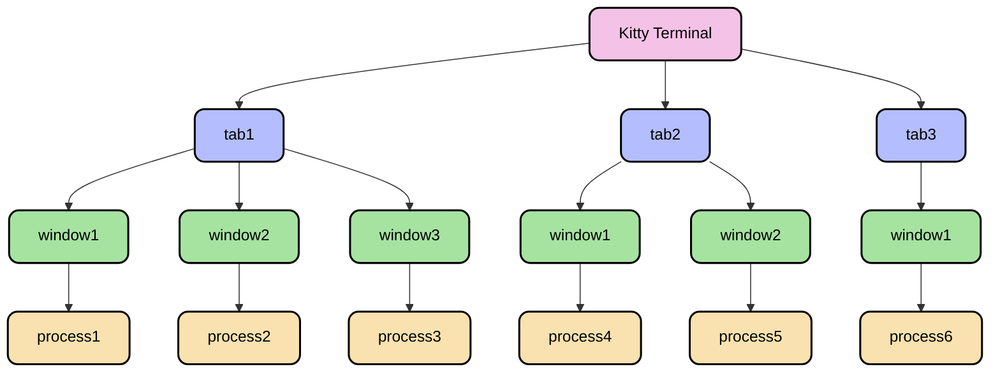

# 如何打造一个更顺手的 Terminal？

## 前言

记得刚入手 Mac 的时候，想的是终于能够脱离 Windows 的苦海，可以像操作 Linux 一样用 Terminal 操作电脑，毕竟直接用**命令行**的效率要远远大于在可视化界面鼠标点击的操作。在刚接触 Linux 系统的时候，我的内心就有了 "*Terminal is all*" 的念头，不过折腾一番之后，也就不了了之。最近 Claude Code 和 Gemini Cli 的爆火，让技术圈又掀起了一波文艺复兴的潮流，于是就想着重新折腾下 macOS 的工具，**看看在 AI 时代，如何打造一个更顺手的 Terminal**，并把这个过程写成博客分享给大家。

如果上网搜："macOS"、"Terminal"这几个关键词，会发现很多文章都是推荐使用 `iTerm2 + oh-my-zsh` 的组合，优点是配置比较简单，跟着教程稍微弄一下，就能够有一个不错的终端。起初我刚接触 macOS 的时候，也选择了这一套配置。但使用一段时间，但总感觉有些地方很别扭，而且启动速度不够快，外观样式也不够好看。

于是就想换个终端，当时考虑的是 [Alacritty](https://github.com/alacritty/alacritty) 和 [Kitty](https://github.com/kovidgoyal/kitty)。这两个都是基于 GPU 加速的终端，总体来说都很不错，根据网上用户讨论，这两款终端各有优劣，总结如下：

- **延迟性能**：尽管 Alacritty 宣称自己是"最快的终端模拟器"（毕竟是 Rust 写的，23333🤣），但实际测试表明 Kitty 的输入延迟也很低。Alacritty 擅长的是吞吐量（处理大量文本输出的能力），而不是输入延迟。
- **功能丰富度**：Kitty 提供了更多功能，包括标签页、窗口分割、会话管理等，而 Alacritty 则更加简洁，专注于核心功能。
- **字体渲染**：在 Linux 上，Alacritty 的字体渲染可能更好，但在 macOS 上，Kitty 的表现通常更佳。特别是对于 Unicode 字符和双宽字符（如中日韩文字）的支持，Kitty 处理得更为优雅。
- **可配置性**：两者都使用配置文件而非 GUI 界面进行设置。Kitty 的文档更为完善，配置选项也更多，而 Alacritty 的配置相对简单但也更受限。
- **特色功能**：Kitty 有一些独特功能，如能够在终端中显示图片、内置的会话管理、以及 "kittens"（小型辅助程序）。

个人使用感受是，如果你喜欢简单、干净的终端体验，Alacritty 可能是更好的选择；而如果你需要更丰富的功能和更好的配置选项，尤其是在 macOS 上，Kitty 可能会是更合适的选择。我最终的选择是 Kitty，谁又能拒绝电脑了多一只猫咪呢。另外比较有意思的一点就是，Kitty 的维护者是一位印度开发者，这个三哥脾气比较大，有的时候提的 issue 不是他想要的，直接就给 close 了，这可能就是个人项目的偏执吧。

## Kitty 的美化之旅

### Kitty 简介

Kitty 是一款现代化的终端模拟器，它的设计理念是充分利用现代计算机硬件的性能，尤其是 GPU 加速渲染，让你在日常工作中获得流畅的终端体验。与许多传统终端不同，Kitty 的每一个细节都经过精心设计，以确保**高性能**和**高度可定制性**共存。

Kitty 的窗口管理采用了一种**层级结构**，理解这一点很重要。在最顶层是操作系统窗口，而在每个操作系统窗口中，可以有多个标签页（tabs）。每个标签页又可以包含多个 Kitty 窗口（windows），它们按照你选择的布局方式排列。这种结构让你能够根据工作需要组织终端空间，无论是并排比较文件，还是监控多个进程。



布局是 Kitty 的另一个亮点，默认提供了不同的布局方案 — 从网格到堆栈，从水平到垂直排列，甚至是分割视图，而且可以在它们之间来回切换。每种布局都有其特定的用途，比如当需要专注于单个任务时可以使用堆栈布局，需要并行处理多项任务时可以使用网格布局。

Kitty 的扩展性也值得一提。它有一个叫做 `kittens` 的脚本框架，能够添加新功能或创建利用 Kitty 特性的小程序。无论是查看图像、比较文件还是输入 Unicode 字符，都可以通过 kittens 实现。如果有特定的需求，甚至可以创建自己的 kitten。

总的来说，Kitty 不仅仅是一个终端模拟器，它更像是一个为**终端密集型工作**精心打造的环境。它结合了速度、灵活性和功能性，让终端操作变得既高效又愉悦。

### 安装

Kitty 的安装非常简单，只需要一行命令即可：

```bash
curl -L https://sw.kovidgoyal.net/kitty/installer.sh | sh /dev/stdin
```

如果需求想体验一些新功能的话，可以访问 https://sw.kovidgoyal.net/kitty/binary/ 下载 nightly 版本的。下载完打开之后，你会发现怎么好丑，黑不溜秋的，一点都不美观。


别急，我们可以在终端里面输入 `kitten themes`，就跳转到 Kitty 的主题选择界面了，可以使用键盘上的 `j` 和 `k` 来上下移动，如果想要搜索的的话，可以使用 `/` 加主题名称的关键字即可。我比较喜欢的是 `Catppuccin Mocha` 主题，我的所有配色都是基于这个主题的。


如果找到了自己喜欢的主题，可以按下回车键，这个时候会出现对应的提示，我们输入 `M` 即可，也就是 `Modify kitty.conf to load Catppuccin-Mocha`。这个时候会在 `~/.config/kitty/` 目录下生成一个 `current-theme.conf` 文件，这个文件里面就记录了主题详细的配色信息。

### 配置

完成上面的步骤，之后我们已经安装好 Kitty Terminal 并且选择了一个还不错的主题。接下来，我们就可以开始配置 Kitty 的配置文件了。

Kitty 的配置文件是 `~/.config/kitty/kitty.conf`，这个文件里面记录了 Kitty 的配置信息，默认的配置内容可以全部删除，因为接下来我们要添加一些配置，来实现一些个性化的功能。配置之后的目录结构如下：

```zsh
❯ tree ~/.config/kitty/
.
├── keymap.py # 快捷键配置
├── kitty.app.icns # 图标
├── kitty.conf # 配置文件
├── themes # 主题文件
│   └── catppuccin
│       ├── frappe.conf
│       ├── latte.conf
│       ├── macchiato.conf
│       └── mocha.conf
└── window.py # 窗口管理
```

下面我们来逐项讲解如何配置 Kitty。

#### 窗口管理

上文提到 Kitty 有着丰富的窗口管理机制，可与编写的 `window.py` 来更好地利用这些特性，让窗口操作变得更加便捷自然。这个脚本本质上是一个 kitten，它扩展了 Kitty 的基本功能，提供了一套优雅的窗口管理解决方案。

```python
from kittens.tui.handler import result_handler

directions = {
    "top": "k",
    "bottom": "j",
    "left": "h",
    "right": "l",
}


def main(args):
    pass


@result_handler(no_ui=True)
def handle_result(args, answer, target_window_id, boss):
    window = boss.active_window
    if window is None:
        return

    cmd = window.child.foreground_cmdline[0]
    act = args[1]  # e.g. -jump
    if act[0] == "-" and cmd[-4:] == "nvim":
        secound = directions[args[2]] if len(args) > 2 else ""
        window.write_to_child(f"\x1b[119;8u{act[1]}{secound}")
        return

    def split(direction):
        if direction == "top" or direction == "bottom":
            boss.launch("--cwd=current", "--location=hsplit")
        else:
            boss.launch("--cwd=current", "--location=vsplit")

        if direction == "right" or direction == "left":
            boss.active_tab.move_window(direction)

    def close():
        boss.close_window()

    def quit():
        boss.quit()

    def jump(direction):
        boss.active_tab.neighboring_window(direction)

    def resize(direction):
        neighbors = boss.active_tab.current_layout.neighbors_for_window(
            window, boss.active_tab.windows
        )
        top, bottom = neighbors.get("top"), neighbors.get("bottom")
        left, right = neighbors.get("left"), neighbors.get("right")

        if direction == "top":
            if top and bottom:
                boss.active_tab.resize_window("shorter", 10)
            elif top:
                boss.active_tab.resize_window("taller", 10)
            elif bottom:
                boss.active_tab.resize_window("shorter", 10)
        elif direction == "bottom":
            if top and bottom:
                boss.active_tab.resize_window("taller", 10)
            elif top:
                boss.active_tab.resize_window("shorter", 10)
            elif bottom:
                boss.active_tab.resize_window("taller", 10)
        elif direction == "left":
            if left and right:
                boss.active_tab.resize_window("narrower", 10)
            elif left:
                boss.active_tab.resize_window("wider", 10)
            elif right:
                boss.active_tab.resize_window("narrower", 10)
        elif direction == "right":
            if left and right:
                boss.active_tab.resize_window("wider", 10)
            elif left:
                boss.active_tab.resize_window("narrower", 10)
            elif right:
                boss.active_tab.resize_window("wider", 10)

    def move(direction):
        boss.active_tab.move_window(direction)

    act = act[1:]
    if act == "split":
        split(args[2])
    elif act == "close":
        close()
    elif act == "quit":
        quit()
    elif act == "jump":
        jump(args[2])
    elif act == "resize":
        resize(args[2])
    elif act == "move":
        move(args[2])

```

这段代码定义了几个核心功能：窗口拆分、关闭、跳转、调整大小和移动。拆分功能（split）会根据指定的方向创建新窗口 — 如果是上下方向，它会水平分割（hsplit）；如果是左右方向，则会垂直分割（vsplit）。这种直观的设计让可以快速构建出符合当前工作需求的窗口布局，无需记忆复杂的命令。

`jump` 函数则允许在不同方向的窗口之间自如跳转，就像在一张二维网格上移动一样。而 `resize` 函数则考虑了窗口的相对位置关系，可以巧妙地调整窗口大小，会检查当前窗口在各个方向上的邻居窗口，然后决定是应该增加还是减少窗口尺寸。

说来惭愧，自己也是反反复复入坑 Neovim 好几次，所以在 Kitty 里面也考虑到了与 NeoVim 的集成。在代码开头定义了一个 directions 字典，将人类可读的方向名称（如"top"）映射到 Vim 风格的按键（如"k"）。当脚本检测到当前窗口正在运行 Neovim 时，它不会执行普通的窗口操作，而是向 Neovim 发送特殊的转义序列，让编辑器内部处理相应的命令。这种无缝集成意味着可以使用相同的快捷键在 Kitty 窗口和 Neovim 分割之间统一导航，大大减少了上下文切换的认知负担。另外，通过 `@result_handler(no_ui=True)` 装饰器，创建了一个无界面的处理程序，它在后台静默工作，不会打断正在使用的工作流。当触发相应的快捷键时，脚本会分析当前环境，执行最合适的操作。

这个窗口管理系统虽然代码不多，但却大大提升了 Kitty 的使用效率。无论是并排查看多个文件，还是监控多个进程，还是在编辑器内外无缝切换，它都提供了简单而强大的解决方案。作为用户，我们可以根据自己的工作习惯，将这些功能绑定到喜欢的快捷键上，打造真正属于自己的终端工作环境。

#### 按键映射处理

在终端的世界里，按键映射是个比较头疼的的难题。早期的终端协议设计时并未考虑到现代编辑器和 shell 对丰富键盘输入的需求，这导致许多组合键在传统终端中无法被正确识别或区分。于是编写 `keymap.py` 脚本来解决这个历史遗留问题而生，让现代应用能够接收到更丰富的键盘输入信息。

```python
from kittens.tui.handler import result_handler
from kitty.keys import keyboard_mode_name


def main(args):
    pass


@result_handler(no_ui=True)
def handle_result(args, answer, target_window_id, boss):
    window = boss.active_window
    if window is None:
        return

    cmd = window.child.foreground_cmdline[0]
    if args[1] == "C-i":
        # Move cursor to the end of line, specific to zsh
        if cmd[-3:] == "zsh":
            window.write_to_child("\x1b[105;5u")

        # Other programs that support CSI u
        elif keyboard_mode_name(window.screen) == "kitty":
            window.write_to_child("\x1b[105;5u")

        # Otherwise send a ^I
        else:
            window.write_to_child("\x09")

    elif args[1] == "S-s":
        if cmd[-4:] == "nvim":
            window.write_to_child("\x1b[115;8u")

```

这个脚本主要处理了两个特殊的按键组合，第一个是 `Ctrl+i` 组合键，它在不同的程序中需要有不同的行为。在传统终端中，`Ctrl+i` 往往与 Tab 键无法区分，因为它们发送了相同的字符码。我们的脚本通过检测当前运行的程序，为不同环境提供了合适的解决方案 — 在 zsh 中，它发送一个特殊的转义序列，使光标跳到行尾；在支持 Kitty 键盘模式的程序中，它发送现代的 CSI u 序列；而在其他程序中，它则回退到传统的 Tab 行为。这种上下文感知的处理让我们能够在不同程序间保持一致的体验。第二个处理的是 `Shift+s` 组合键，专门针对 Neovim 编辑器的需求。当检测到当前窗口运行的是 Neovim 时，脚本会发送一个特殊的转义序列 `\x1b[115;8u`，让 Neovim 能够识别并处理这个按键组合。这种处理方式利用了现代终端的 CSI u 协议，该协议允许传递更详细的按键信息，包括各种修饰键的状态。

#### 终端配置

> 该部分配置采用分段讲解的方式，完整的配置文件参考：[kitty-conf](https://github.com/QuakeWang/dotfiles/blob/main/kitty/kitty.conf)。

在美化终端的时候，一个好看的字体则起到非常重要的作用。在本次的配置中会使用到 `SF Mono` 和 `Symbols Nerd Font` 字体，可以按照下面的命令进行安装：

```bash
brew tap homebrew/cask-fonts
brew install --cask font-sf-mono
brew install --cask font-symbols-only-nerd-font
brew install --cask sf-symbols
```

下面是具体的配置参考，可以根据实际情况按需配置：

```kitty.conf
font_family      SF Mono
font_size    13.0
modify_font  cell_height 150%
modify_font  underline_position     5
modify_font  strikethrough_position 5
```

- **font_family**: 使用 SF Mono 字体（macOS 系统字体）
- **font_size**: 字体大小 13.0
- **cell_height**: 字符高度调整为 150%，增加行间距
- **underline_position**: 下划线位置调整
- **strikethrough_position**: 删除线位置调整

```kitty.conf
# Seti-UI + Custom
symbol_map U+E5FA-U+E6AC                                Symbols Nerd Font
# Devicons
symbol_map U+E700-U+E7C5                                Symbols Nerd Font
# Font Awesome
symbol_map U+F000-U+F2E0                                Symbols Nerd Font
# Font Awesome Extension
symbol_map U+E200-U+E2A9                                Symbols Nerd Font
# Material Design Icons
symbol_map U+F0001-U+F1AF0                              Symbols Nerd Font
# Weather
symbol_map U+E300-U+E3E3                                Symbols Nerd Font
# Octicons
symbol_map U+F400-U+F532,U+2665,U+26A1                  Symbols Nerd Font
# [Powerline Symbols]
symbol_map U+E0A0-U+E0A2,U+E0B0-U+E0B3                  Symbols Nerd Font
# Powerline Extra Symbols
symbol_map U+E0A3,U+E0B4-U+E0C8,U+E0CA,U+E0CC-U+E0D4    Symbols Nerd Font
# IEC Power Symbols
symbol_map U+23FB-U+23FE,U+2B58                         Symbols Nerd Font
# Font Logos (Formerly Font Linux)
symbol_map U+F300-U+F32F                                Symbols Nerd Font
# Pomicons
symbol_map U+E000-U+E00A                                Symbols Nerd Font
# Codicons
symbol_map U+EA60-U+EBEB                                Symbols Nerd Font
# Additional sets
symbol_map U+E276C,U+2771,U+2500-U+259F                 Symbols Nerd Font
```
这部分配置了 Nerd Font 符号映射，支持各种图标集（Devicons、Font Awesome、Material Design Icons 等），用于在终端中显示丰富的图标。

```kitty.conf
map cmd+equal  change_font_size all +1.0
map cmd+minus  change_font_size all -1.0
map cmd+0      change_font_size all 0
```

**字体大小**设置：

- `Cmd+Equal`：增加字体大小
- `Cmd+Minus`：减小字体大小
- `Cmd+0`：重置字体大小

```kitty.conf
scrollback_lines -1

scrollback_fill_enlarged_window yes
```

- **scrollback_lines**: 设置为 -1 表示无限回滚历史
- **scrollback_fill_enlarged_window**: 窗口放大时用回滚内容填充


```kitty.conf
url_prefixes file ftp ftps git http https mailto sftp ssh

strip_trailing_spaces always

select_by_word_characters @-./_~?&=%+#
```

- **url_prefixes**: 定义可点击的 URL 前缀类型
- **strip_trailing_spaces**: 总是删除行尾空格
- **select_by_word_characters**: 定义单词选择的字符集

```kitty.conf
remember_window_size  no
initial_window_width  1080
initial_window_height 720

enabled_layouts splits, stack
```

- **remember_window_size**: 不记住窗口大小
- **initial_window_width/height**: 初始窗口尺寸 1080x720
- **enabled_layouts**: 启用 splits 和 stack 布局

> - Splits 布局是 Kitty 中最灵活的布局方式，它允许通过水平和垂直分割来创建任意复杂的窗口排列。可以先水平分割创建左右两个区域，然后在左侧区域再次垂直分割，形成上下两个子区域。这种布局特别适合需要同时查看多个相关文件或监控多个进程的场景，比如在左侧编辑代码，右侧运行测试，同时在底部查看日志输出。
> - Stack 布局则是一种更专注的工作模式，它一次只显示一个窗口，其他窗口被隐藏起来。当需要全神贯注于某个任务时，这种布局可以消除视觉干扰，让专注于当前的工作。可以通过快捷键在隐藏的窗口之间切换，就像在浏览器标签页间切换一样。这种布局特别适合需要深度思考的编程任务，或者当需要在一个窗口中运行长时间的命令时。

```kitty.conf
tar_bar_edge  top
tab_bar_style powerline
tab_powerline_style round
```

- **tar_bar_edge**: 标签栏位于顶部
- **tab_bar_style**: 使用 powerline 样式
- **tab_powerline_style**: 圆角样式

```kitty.conf
include themes/catppuccin/macchiato.conf

background_opacity 0.9
background_blur 30
```

这里则是对**外观样式**再优化一点，增加了透明度和毛玻璃的效果，可以把一开始下载选择的主题创建目录并替换即可。

- **include**: Catppuccin Macchiato 
- **background_opacity**: 背景透明度 90%
- **background_blur**: 背景模糊 30 像素


```kitty.conf
macos_option_as_alt yes

macos_quit_when_last_window_closed yes

macos_show_window_title_in window

macos_colorspace displayp3

text_composition_strategy 1.2 20
```

这部分是针对 **macOS 特定的优化**：

- **macos_option_as_alt**: Option 键作为 Alt 键
- **macos_quit_when_last_window_closed**: 关闭最后一个窗口时退出
- **macos_show_window_title_in**: 在窗口内显示标题
- **macos_colorspace**: 使用 displayp3 色彩空间
- **text_composition_strategy**: 文本合成策略


```kitty.conf
map ctrl+i kitten keymap.py "C-i"

# Edit current command via neovim, specific to zsh
map ctrl+, send_text normal,application  \x1b[44;5u
```

**特殊按键**处理部分解决了终端输入的历史遗留问题：

- `ctrl+i` 的映射通过我们之前编写的 keymap.py 脚本处理，确保在不同程序间的一致性
- `ctrl+,` 的组合则专门为 zsh 环境下的 Neovim 集成设计，发送特殊的转义序列让编辑器能够识别并处理这个按键


```kitty.conf
map cmd+c        copy_to_clipboard
map cmd+v        paste_from_clipboard
map cmd+shift+v  paste_from_selection
```

**剪贴板**操作采用了 macOS 用户熟悉的快捷键模式，方便使用：

- `cmd+c` 和 `cmd+v`：复制和粘贴
- `cmd+shift+v`：提供了从选择缓冲区粘贴的选项，这在处理临时文本时特别有用

```kitty.conf
map alt+k  combine : scroll_line_up : scroll_line_up : scroll_line_up : scroll_line_up : scroll_line_up
map alt+j  combine : scroll_line_down : scroll_line_down : scroll_line_down : scroll_line_down : scroll_line_down

map cmd+/        scroll_to_prompt -1
map cmd+shift+/  scroll_to_prompt 1

map cmd+alt+/  show_last_command_output
```

**滚动控制**的设计考虑了不同粒度的滚动需求：

- `alt+j/k`：快速的多行滚动，一次滚动五行的设计让浏览长文本更加高效
- `cmd+/` 和 `cmd+shift+/`：智能的提示跳转功能，能够在命令历史中快速定位到上一个或下一个提示符
- `cmd+alt+/`：查看最后命令输出的便捷方式

```kitty.conf
map cmd+ctrl+k   kitten window.py +split top
map cmd+ctrl+j   kitten window.py +split bottom
map cmd+ctrl+h   kitten window.py +split left
map cmd+ctrl+l   kitten window.py +split right

map cmd+w        kitten window.py -close

map cmd+k        kitten window.py -jump top
map cmd+j        kitten window.py -jump bottom
map cmd+h        kitten window.py -jump left
map cmd+l        kitten window.py -jump right
map cmd+shift+k  kitten window.py -resize top
map cmd+shift+j  kitten window.py -resize bottom
map cmd+shift+h  kitten window.py -resize left
map cmd+shift+l  kitten window.py -resize right
map cmd+alt+k    kitten window.py -move top
map cmd+alt+j    kitten window.py -move bottom
map cmd+alt+h    kitten window.py -move left
map cmd+alt+l    kitten window.py -move right

map cmd+enter toggle_layout stack
```

**窗口管理**快捷键采用了层次化的设计，使用 `hjkl` 四键作为基础导航方向。

- `cmd+ctrl+{hjkl}`：在上下左右四个方向拆分窗口
- `cmd+w`：关闭单个窗口
- `cmd+{hjkl}`：在窗口间跳转
- `cmd+shift+{hjkl}`：调整窗口大小
- `cmd+alt+{hjkl}`：移动窗口位置
- `cmd+enter`：切换到堆栈布局，能够在专注模式和分屏模式间自如切换

```kitty.conf
map cmd+t        new_tab
map cmd+shift+w  close_tab
map cmd+shift+t  set_tab_title

map cmd+[      previous_tab
map cmd+]      next_tab
map cmd+alt+[  move_tab_forward
map cmd+alt+]  move_tab_backward

map cmd+1  goto_tab 1
map cmd+2  goto_tab 2
map cmd+3  goto_tab 3
map cmd+4  goto_tab 4
map cmd+5  goto_tab 5
map cmd+6  goto_tab 6
```

**标签页管理**快捷键采用了类似浏览器的操作模式：

- `cmd+t`：创建新标签页
- `cmd+shift+w`：关闭当前标签页
- `cmd+shift+t`：设置标签页标题
- `cmd+[` 和 `cmd+]`：在标签页间前后导航
- `cmd+alt+[` 和 `cmd+alt+]`：移动标签页位置
- `cmd+1-6`：直接跳转到特定标签页的快速方式

```kitty.conf
map cmd+o        open_url_with_hints
map cmd+q        kitten window.py -quit
map cmd+p        kitten hints --type path --program -
map cmd+shift+p  kitten hints --type path
```

**文本交互功能**：

- `cmd+o`：URL 提示功能，能够快速打开终端中显示的链接
- `cmd+q`：通过窗口管理脚本提供快速退出功能
- `cmd+p` 和 `cmd+shift+p`：路径提示功能，前者会尝试用默认程序打开选中的路径，后者则仅显示路径提示供选择


```kitty.conf
map cmd+backspace  send_text all \u17
map cmd+s          kitten keymap.py "S-s"
map cmd+r          clear_terminal to_cursor active
map cmd+f          combine : show_scrollback : send_text normal,application /
map cmd+shift+f    toggle_maximized
```

**其他功能快捷键**：

- `cmd+backspace`：发送特殊的退格字符
- `cmd+s`：通过按键映射脚本处理特殊按键组合
- `cmd+r`：清除到光标位置的功能
- `cmd+f`：结合了显示滚动缓冲区和发送搜索命令，可以快速查该 window 的内容
- `cmd+shift+f`：最大化切换功能

终于说完了这个配置文件，如果能够耐心看完的话，相信你已经对 Kitty 的配置有了一个大致的了解。当然如果初次使用，一次性加了那么多快捷键肯定是记不住的，所以建议按需选择，比如标签页和窗口管理就很推荐。其余的配置，在使用过程可以根据需求进行调整。而且这一部分可以参考官方文档，[Kitty 配置](https://sw.kovidgoyal.net/kitty/conf.html)，进行更深入的优化。

#### SSH 踩坑

在配置完 Kitty 之后，我尝试连接了下服务器，能够成功登录服务器，但是如果遇到命令输入错误，想要删除的时候，发现按下 `backspace` 键，并没有删除而是直接变成了空格。此外在服务器上使用 `top` 命令查看进程，会发现报错如下：

```bash
'xterm-kitty': unknown terminal type.
```

这是因为 Kitty 的终端类型没有被正确配置，导致在服务器上无法正常使用。在查阅了 Kitty 的文档后，发现 Kitty 引入了自己的 TERM 变量，而远程会话，确切地说是 terminfo 无法正确识别，即导致了上述报错。

**解决方案**：可以把 TERM 设置成比较通用的，比如 `xterm-256color`，把它放到 `~/.zshrc` 或者 `~/.bashrc` 里，根据使用的 shell 而定。

```zsh
export TERM=xterm-256color
```

另外，在 Kitty 的 [ssh](https://sw.kovidgoyal.net/kitty/kittens/ssh/) 文档中还提到：

> You should end up at a shell prompt on the remote host, with shell integration enabled. If you like it you can add an alias to it in your shell’s rc files:

```zsh
alias s="kitten ssh"
```

这么做的好处是可以增强 SSH 的体验，可以保证远程服务器和本地终端的一致性。

## 演示

当完成上述配置之后，就可以打开 Kitty 多多练习熟悉这些快捷键，相信你一定会爱上这个终端的。下面是一个简单的演示图片：


在终端最下面，可以观察到使用 `cmd+t` 创建了五个标签页，使用 `cmd+1` 跳转到了第一个标签页，使用 `cmd+shift+t` 设置标签页标题为“example”。其中这个页面又被分成了三个窗口，左边部分是 `btop`，右上是 `fastfetch`，右下是 `fzf`。并使用 `cmd+shift+k` 和 `cmd+shift+j` 调整了窗口大小。如果想关闭窗口，使用 `cmd+w` 即可。

诶，本篇博客重点讲解了 Kitty 的配置，但上图演示的内容又是如何实现的呢？以及开篇吐槽的 oh-my-zsh 又该如何优化呢？在后续的文章会一步一步介绍，完整实现一个好用的 macOS，敬请期待。

## 结尾

其实，这个系列的文章是我一直想写但又不太敢去写的，毕竟互联网上关于 macOS 的教程已经很多了，而且我对于 macOS 也只是停留在使用阶段，并没有太深入去学习，所以难免会有很多不足之处。在写这篇博客的时候，我也是参考了很多其他大佬的教程，并结合自己的需求进行了优化。希望不会烂尾，能够持续更新下去吧。

但话又说回来，电脑最开始的交互方式就是没有鼠标，而是通过键盘来操作的。想想那些穿着白大褂，面对黑底绿字终端敲击键盘的工程师们，他们用最原始的方式与计算机对话，却创造了改变世界的技术。随着图形界面的普及，我们似乎渐渐忘记了这种极致高效的交互方式，沉浸在了五彩斑斓的窗口和图标中。在我们享受这些现代化工具的同时，也应该向那些早期计算机先驱致敬。是他们在没有鼠标、没有图形界面、甚至连基本的文本编辑器都十分简陋的年代，用键盘与机器对话，奠定了今天计算机科学的基础。他们用纯粹的文本命令构建了操作系统、编程语言和网络协议，这些至今仍是我们数字世界的骨架。

而今天，在 AI 时代的浪潮下，命令行界面（CLI）又一次焕发出新的生机。大型语言模型的交互，云服务的管理，甚至是日常的开发工作，都在回归到基于文本的交互模式。这不仅仅是一种怀旧，更是对效率的追求 — 纯文本的表达往往比点击和拖拽更精准，更直接，也更易于自动化。

读到这里，你可能会问既然是打造 AI 时代更顺手的终端，但似乎并没有太体现 AI 在哪里？哈哈哈，我承认确实有点标题党博眼球，这一点之后的配置文章会逐步引出的。现在谈到 AI 终端，大家可能第一反应就是 [Warp](https://www.warp.dev/)，但这个工具已经改变了传统终端的使用方式，而且有点重，使用一段时间会发现在磁盘中占用 1GB 多，作为一个终端工具，这个体积有点大了。相比 Kitty 则是一个轻量级的终端，配置简单，功能强大，而且支持多种主题，非常适合我这种懒人。


最后，我想说的是在技术发展的螺旋中，AI CLI 的出现并非是在简单地回归终端，而是在更高的层次上重新发现文本交互的力量。有一次饭后和同事散步聊天就有提到，每一次 AI 的发展都会沉淀下一些东西，这几年 LLM 的爆火，已经让传统的文字交互发生改变。在这个 AI 加持的新时代，终端或许是更好的交互方式，使得我们能够比以往任何时候都更高效、更创造性地与计算机协作，共同面对未来的挑战。

> 参考：
>
> - [Alacritty vs Kitty: Which Terminal Should You Choose?](https://www.reddit.com/r/archlinux/comments/n9noje/alacritty_vs_kitty/)
> - [Kitty 窗口管理](https://github.com/chancez/dotfiles/blob/master/kitty/.config/kitty/relative_resize.py)
> - [Kitty 配置](https://sw.kovidgoyal.net/kitty/conf.html)
> - [macOS Setup](https://sxyz.blog/macos-setup/)

