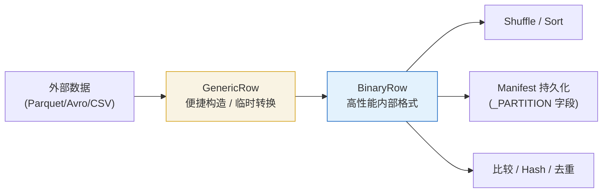
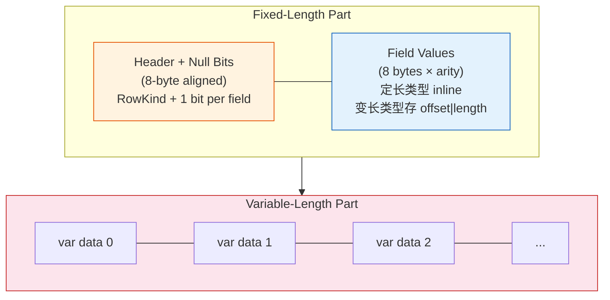
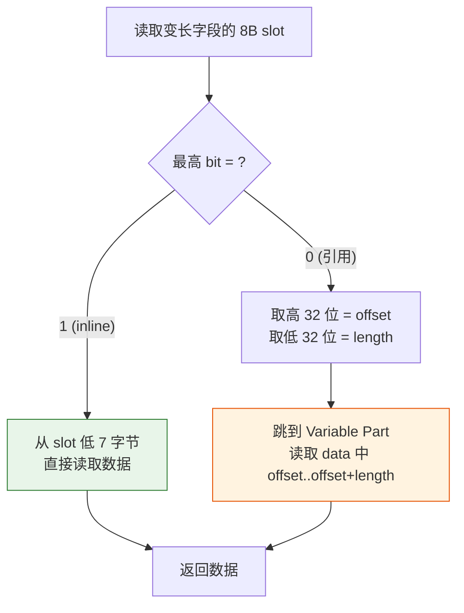
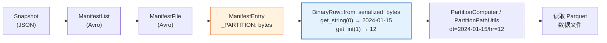

## 分区表读取任务

好久没有写技术博客了，尤其是 AI 泛滥之后，总觉得写技术博客的价值越来越少。不过前段时间，重新回到开源社区，做了让 paimon-rust 支持读取分区表（[Issue #124](https://github.com/apache/paimon-rust/issues/124)）的任务。在完成这个 issue 的过程中，还是学到不少知识的，就随手写写吧。

这个任务有一条清晰的依赖链：要读分区表，首先要能解析 Manifest 中的分区信息；而分区信息在 Manifest 的 `_PARTITION` 字段中以 Avro `bytes` 存储。对 paimon-rust 来说，这段 bytes 是 Paimon 的 serialized BinaryRow：前 4 个字节是 big-endian 的 arity，后面才是 BinaryRow 的原始 payload。也就是说，不搞懂 BinaryRow，分区表就读不了。

在大模型的帮助下，读源码的门槛在大幅度降低。看了 BinaryRow 相关的代码之后，觉得这个设计值得单独聊聊——它不只是一个序列化格式，更是 Paimon 在性能和工程实践之间做出的一系列精巧 trade-off 的缩影。

## BinaryRow 到底要解决什么问题

要理解 BinaryRow，得先知道它替代了什么。

Paimon 内部有一个 `InternalRow` 接口，用来表示"一行数据"。最直觉的实现是 `GenericRow`，本质上就是一个 Java Object 数组：

```java
public final class GenericRow implements InternalRow {
    private final Object[] fields;  // [Integer(42), BinaryString("hello"), null, ...]
}
```

这种实现在功能上完全够用，可以通过 `fields[0]` 拿到第一个字段，`fields[1]` 拿到第二个，什么类型都能存。但在数据密集的场景下——比如 Flink 每秒处理几百万行，或者一次 Compaction 要归并上亿行——GenericRow 会栽在三个地方。

**第一是序列化。** 数据在 shuffle、落盘、跨进程传递的时候，需要把 Object 数组变成 bytes。这意味着要遍历每个字段，判断类型，逐一编码。反过来读的时候再逐一解码。每行都要走一遍这个逻辑，CPU 开销是 O(N) 的。

**第二是 GC 压力。** 一行 10 个字段，就是 10 个 Java Object。如果字段是 int 或 long，还会被装箱成 Integer 和 Long。几百万行就是几千万个小对象散布在堆上，Full GC 一来整个 JVM 都要抖一下。

**第三是 Cache 不友好。** Object 数组存的是引用（指针），实际数据散落在堆内存的各个角落。访问一个字段需要先跳到引用地址，再读取数据——这两次内存访问大概率不在同一个 Cache Line 里，CPU 的 L1/L2 缓存几乎帮不上忙。

BinaryRow 的思路非常直接：**把一行数据编码成一段连续的 bytes view**。不要 Object 数组，不要装箱，不要指针跳转。概念上一行数据就是一段平坦的内存——在 Java 实现中底层是 `MemorySegment`（可以指向堆内或堆外内存），不一定真的是单个 `byte[]`。

这样做的好处是一目了然的：当数据已经处在 BinaryRow 形态时，传输和落盘可以按连续 bytes 复制，避免重复做逐字段类型分派和编码；对象数量从 N 个字段的 N 个 Object 降到极少数几个引用，GC 压力显著降低；逻辑布局紧凑，相较散布在堆上的对象图更 cache-friendly，CPU prefetch 可以高效预取。

把两者的核心差异放在一起对比：

| 维度 | GenericRow | BinaryRow |
|------|-----------|----------|
| 序列化 | 逐字段编码，O(N fields) | 已编码数据可按 bytes 复制，O(byte length) |
| GC 压力 | N 个 Object + 装箱 | 极少数引用 |
| Cache 友好性 | 指针跳转，数据散布 | 连续内存，可预取 |
| 随机访问 | O(1)（数组下标） | O(1)（偏移计算） |
| 适用场景 | 构造 / 临时转换 | 内部高性能路径 |

从数据流的角度看，两者在 Paimon 中各有分工：



简单来说，GenericRow 是"方便的入口"，BinaryRow 是"高效的引擎"。在 Flink Sink 这种高吞吐路径上，数据从 Flink 侧进来时通常已经是 BinaryRow 格式（Flink 内部用同源的 BinaryRowData），不会先建一遍 GenericRow 再转。

这个思路并不是 Paimon 首创——它直接继承自 Apache Flink 的 `BinaryRowData`，而 Flink 的设计又受到了数据库系统中 "tuple-at-a-time" vs "column-at-a-time" 这类经典讨论的影响。Paimon 从 Flink 独立出来之后保留了这套格式，因为它确实好用。

## 内存布局

说了这么多好处，那 BinaryRow 的 bytes 里面到底是什么样的？一段连续内存里怎么找到第 N 个字段？

先看去掉 arity 前缀之后的 raw BinaryRow payload。它的内存分为两大块：固定长度部分和变长部分。




**Header + Null Bits** 共同占据 raw payload 的开头区域，并按 8 字节对齐。逻辑上的 Header 只用第 0 个字节存 RowKind——这行数据是新增（INSERT）、更新前（UPDATE_BEFORE）、更新后（UPDATE_AFTER）还是删除（DELETE）。这个信息在 changelog 语义和 Compaction 归并时至关重要。

**Null Bits** 从 bit 8 开始，用 1 个 bit 表示一个字段是否为 null。bit 为 1 就是 null，为 0 就是有值。这个开头区域的宽度计算公式是 `((arity + 63 + 8) / 64) * 8`。拆解一下：`+8` 是因为 RowKind 占了前 8 个 bit，null 位从第 8 个 bit 开始计数；`+63` 配合整除 64 实现**向上取整到 8 字节边界**。在当前 Rust 实现里，源码常量名是 `HEADER_SIZE_IN_BYTES = 8`，它参与 bit offset 和 bitset width 的计算，最终得到这个对齐后的 header/null-bits 区域宽度。

**Field Values** 是最关键的部分。不管字段实际是什么类型，**每个字段固定占 8 个字节**。int 占 4 字节？也给它分 8 字节。boolean 只要 1 字节？也是 8 字节。这看起来有点浪费，但换来了一个极其重要的性质：**第 N 个字段的偏移位置可以用一次乘法算出来**（`nullBitSetSize + N × 8`），不需要遍历前面的字段。O(1) 的随机访问能力，在排序、比较、hash 等操作中价值巨大。

**Variable-Length Part** 放在最后面，存那些在 8 个字节里装不下的数据——比如超过 7 字节的字符串、大 DECIMAL、嵌套的 Array/Map/Row 等。固定长度部分里对应的 8 字节 slot 存的是一个"指针"：高 32 位是 offset（数据在 variable part 中的起始位置），低 32 位是 length（数据长度）。

### 举个🌰

假设有一个分区表的分区 schema 是 `(region STRING, year INT, city STRING)`，写入一行 `("cn", 2024, "shanghai")`。arity = 3，RowKind = INSERT。

先算各区域大小。Header + null bits 宽度 = `((3 + 63 + 8) / 64) × 8 = 8` 字节。固定长度部分 = 8（header + null bits）+ 8 × 3（三个字段）= 32 字节。Variable part 需要存 "shanghai"（8 字节，超过了 7 字节阈值），而 "cn" 只有 2 字节，不需要放到 variable part。

完整的内存布局如下（小端序，按逐字节 dump 展示）：

```
地址     字节值           说明
──────   ──────────────   ────────────────────────────────────
            ── Header + Null Bit Set（8 bytes）──
 [0]     00               Header: RowKind = INSERT
 [1]     00               Null bits：全 0，三个字段都非 null
 [2-7]   00 00 00 00      padding 至 8 字节对齐
         00 00

            ── Field 0: region = "cn"（inline）──
 [8]     63               'c'
 [9]     6E               'n'
 [10-14] 00 00 00 00 00   padding
 [15]    82               0x80 | 2 = 最高 bit 标记 inline，长度 = 2

            ── Field 1: year = 2024（i32）──
 [16-19] E8 07 00 00      2024 的小端序表示（i32 只占 4 字节）
 [20-23] 00 00 00 00      高位补零

            ── Field 2: city = "shanghai"（引用 variable part）──
 [24-27] 08 00 00 00      length = 8（低 32 位，小端 i32）
 [28-31] 20 00 00 00      offset = 32（高 32 位，小端 i32，variable part 起始位置）

            ── Variable-Length Part ──
 [32-39] 73 68 61 6E      "shanghai" 实际字符串数据
         67 68 61 69

Total: 40 bytes
```

整行数据，40 个字节，连续排列在一段内存中。读取第 1 个字段（year）的逻辑是：算出偏移 `8 + 1 × 8 = 16`，读 `data[16..20]` 转成 i32 = 2024。没有任何指针跳转，没有任何类型判断，一次内存访问就拿到了值。

## 设计上的 trade-off

上面的例子中，"cn" 和 "shanghai" 虽然都是 STRING 类型，但编码方式完全不同。这是 BinaryRow 最精巧的设计之一——对变长字段有两种编码策略。

**策略 A：短数据直接塞进 8 字节 slot（inline）。** 如果一个字符串或 binary 数据不超过 7 个字节，它可以直接存在固定长度部分的 8 字节 slot 里。编码规则：把 8 字节 slot 视为一个 64-bit word，**最高字节**（big-endian 意义上的最高位字节）用于存储标记和长度——最高 bit 置 1 表示“这是 inline 数据”，低 7 bits 存数据长度（0~127）；剩下的 7 个字节存实际数据。

在 little-endian 内存中，这个“最高字节”落在 8-byte slot 的最后一个地址——上面示例中 `[15]` 位置的 `0x82` 就是它。源码在读取时会显式处理字节序（参见 `MemorySegmentUtils` 中的 byte order 逻辑）。以 `"cn"` 为例：数据只有 2 字节，标记字节 = `0x80 | 2 = 0x82`，slot 的低 2 字节存了 `'c'` 和 `'n'`。

**策略 B：长数据放到 variable part，slot 里存"指针"（引用）。** 超过 7 字节的数据放不进 slot，就存到 variable-length part 里，slot 中存 offset 和 length。最高 bit 为 0，表示这是一个引用而不是 inline 数据。

读取的时候怎么区分？看最高 bit。如果是 1，数据就在 slot 里，直接读；如果是 0，按 offset+length 去 variable part 取。当前 Rust 实现里，按 `Datum` 写入的路径会对 `len <= 7` 的 string/binary 自动选择 inline；底层的 `write_string` / `write_binary` 仍然是显式写 variable part 的 API。整个决策过程如下：



只需要一次位运算就能决定走哪条路径。

这个设计背后的 trade-off 很有意思。inline 策略牺牲了 1 bit 的表示空间（最高 bit 被占用了），但换来的是：**对于短字符串，一次内存访问就能拿到数据，不需要跳到 variable part**。在实际业务中，分区字段的值往往很短——日期 "2024-01-15" 是 10 字节（刚好超过 7 字节，走引用），但如果分区是按小时 "00"~"23" 只有 2 字节，或者地区缩写 "us"、"cn" 也只有 2 字节，都能享受 inline 的收益。

这 7 字节的阈值也不是随便选的。一个 slot 8 字节，最高字节的 1 bit 做标记、7 bit 存长度（0~127），剩下正好 7 个字节放数据。刚好把 8 字节用满，没有任何浪费。

## 设计哲学的几个提炼

回过头看 BinaryRow 的整体设计，有几个反复出现的思路值得提炼。

### 用空间换 O(1) 随机访问

每字段固定 8 字节是最典型的例子。boolean 只需要 1 字节，给它分 8 字节确实浪费了 7 字节。但换来的 O(1) 随机访问能力让后续所有操作——排序时比较第 K 列、hash 时定位到主键列——都变成了常数时间的偏移计算，不需要像 Protocol Buffer 那样逐字段解析 varint 来找到目标字段。

举个具体的数字来感受：假设一行有 20 个字段，你要读取第 19 个字段。BinaryRow 的计算是 `8 + 19 × 8 = 160`，一次乘法一次加法，直接跳到目标偏移。而 Protobuf 需要从第 1 个字段开始，逐个解析 tag 和 varint length，跳过前 18 个字段之后才能到达第 19 个。当你在 Compaction 中对上亿行做归并排序，每行都要反复访问主键列时，在频繁随机访问场景下两者会有显著的性能差距。

在数据密集的系统中，可预测的性能往往比极致的压缩率更重要。宁可多占一些内存，也不希望某个字段因为前面有一个超长字符串，访问延迟突然翻了好几倍。

### 让热路径做最少的事

**inline 编码就是这个思路的体现。** 分区值、主键值是被读取频率最高的字段——每次 scan 都要读分区值来决定路径，每次 compaction 都要读主键来做归并。把这些高频访问的短数据直接放在 fixed part 里，省掉一次间接寻址，积累起来就是可观的性能差异。

算一笔账就能感受到这个"积累"有多大：一个表有 1000 个分区、每个分区 100 个数据文件，一次全表 scan 要读 10 万条 ManifestEntry，每条都要取 `_PARTITION` 中的分区值。如果分区字段是 `hr='08'`（2 字节，走 inline），这 10 万次取值每次都是直接从 fixed part 的 slot 里读取，省掉了 10 万次跳到 variable part 的间接寻址。在 Manifest 解码、分区提取、排序比较这类 CPU 热路径里，少一次内存间接访问的收益会被放大到非常可观的程度。

### 二进制层面的可比较性

BinaryRow 的 `equals()` 和 `hashCode()` 直接在 bytes 层面操作——比较两行是否相等就是 memcmp，计算 hash 就是对 bytes 做 hash。不需要逐字段拆箱、比较、再装箱。这在 hash join、hash aggregate、去重等场景中的收益是巨大的。

但这也带来了一个隐含的约束：**如果两个 BinaryRow 表示相同的数据，它们的 bytes 必须完全一致**。这个约束在处理 null 字段时尤为关键。如果一个字段被设为 null，仅仅设置 null bit 是不够的——slot 里可能还残留着之前的脏数据。虽然业务逻辑上这个值不会被读取，但 memcmp 会比较到它。所以 Java 源码里 `setNullAt` 不仅设置 null bit，还会把对应的 8 字节 slot 清零。逻辑上可以概括为：

```java
public void setNullAt(int i) {
    bitSet.set(i + HEADER_SIZE_IN_BITS);   // 设置 null bit
    segment.putLong(getFieldOffset(i), 0); // 清零 slot，保证 memcmp 一致性
}
```

看起来多写了一行代码，但保住了整个 equals/hash 语义的正确性。

## 从 Java 到 Rust：跨语言实现的思考

参与 paimon-rust 的开发过程中，我对 BinaryRow 做了 Java → Rust 的移植（[PR #133](https://github.com/apache/paimon-rust/pull/133)）。这个过程中有一些有趣的发现。

**有些 Java 层面的复杂性在 Rust 中可以直接消失。** 最明显的是 `MemorySegment`。Java Paimon 的 BinaryRow 不直接操作 `byte[]`，而是通过 `MemorySegment` 抽象访问——这层抽象是为了支持堆外内存（off-heap），规避 GC。`BinarySection`（BinaryRow 的基类）实际上持有 `MemorySegment[]` 引用，一个 BinaryRow 可以跨多个 segment 存储。但在当前的 Rust 实现里，不需要引入 Java 那样的 MemorySegment 抽象——没有 GC，`Vec<u8>` 或 `&[u8]` 本身就是高效的连续内存，直接用 slice 操作就够了。

**二进制格式本身必须 bit-for-bit 一致。** Paimon 的 Manifest 文件可能由 Java 端写入，Rust 端要读取。`_PARTITION` 字段里的 bytes 是 serialized BinaryRow，Rust 端会先解析 4 字节 big-endian arity 前缀，再用完全相同的规则解码 raw payload——小端序、null bit 从第 8 位开始、inline 标记在最高 bit。格式兼容性是跨语言实现的生命线。

**Rust 的所有权模型天然解决了 Java 的一个隐患。** Java 的 BinaryRow 通过 `pointTo(segment, offset, size)` 指向外部内存。它本身并不拥有底层数据，只是保存了对 `MemorySegment[]` 的引用，本质上相当于一次没有类型系统约束的隐式 borrow。风险出现在底层 buffer 被复用或覆写的时候，比如流式处理中，同一段 segment 内存被下一个 batch 的数据覆盖，BinaryRow 后续读到的内容也会随之改变。对 GC 来说，这个引用依然合法，程序通常不会因为内存安全问题直接失败；真正失效的是对象和底层数据之间原本约定的生命周期关系。在 Java 里，这类风险需要通过清晰的接口约定、文档说明，以及必要时的主动拷贝来控制。

在 Rust 中，这个问题在编译期就被解决了：

```rust
// Owned：数据被 move 进 BinaryRow，生命周期没有任何歧义
let row = BinaryRow::from_bytes(arity, data);  // data 的所有权转移给 row

// 如果未来需要零拷贝读取，可以用带生命周期约束的引用：
let row_ref = BinaryRowRef::from_slice(arity, &buffer[offset..]);
// 编译器保证 buffer 的生命周期 >= row_ref，不存在悬垂引用
```

`Vec<u8>` 做 owned 时数据跟着 BinaryRow 走，`&'a [u8]` 做 borrow 时编译器强制检查引用有效性。这种安全性不需要额外的运行时开销，是 Rust 类型系统带来的“免费午餐”。

## BinaryRow 在分区表链路中的角色

啰里八唆扯了一堆，现在回到最初的那个任务——有了 BinaryRow 的完整实现之后，分区表读取链路的最后一块拼图也就到位了。来看一下实际的数据流：

在 Paimon 中，每个数据文件的元数据都记录在 Manifest 文件中，而 Manifest 中有一个关键字段 `_PARTITION`，它的类型是 `bytes`。这段 bytes 是分区值经过 BinaryRow 编码后的 serialized 结果：它包含 arity 前缀和 raw BinaryRow payload。

比如一个按 `(dt STRING, hr INT)` 分区的表，分区值 `("2024-01-15", 12)` 会被编码成 serialized BinaryRow bytes，然后存进 Manifest 的 Avro 文件中。整条读取链路如下：



读取时，Rust 端需要：

1. 从 Avro 中取出这段 bytes
2. 用 `BinaryRow::from_serialized_bytes(data)` 读取 arity 前缀，并还原出 BinaryRow
3. 调用 `row.get_string(0)` 得到 `"2024-01-15"`，`row.get_int(1)` 得到 `12`
4. 拼出分区路径 `dt=2024-01-15/hr=12`
5. 用这个路径去对象存储上找到实际的 Parquet 数据文件

这条链路把前面提到的很多概念串了起来：Snapshot 是读取入口，ManifestList 列出所有 Manifest 文件，ManifestFile 中的 ManifestEntry 包含 `_PARTITION` 的 serialized BinaryRow bytes，解码后生成分区路径，最终定位到 Parquet 数据文件。BinaryRow 就像一颗不起眼但关键的螺丝钉，拧在整个链路的中间位置。

## 结语

BinaryRow 的设计其实不复杂——把一行数据编码成连续 bytes，固定宽度的 slot 保证 O(1) 访问，短数据 inline 减少间接寻址，长数据用 offset+length 引用。没有什么魔法，每个决策背后都是朴素的 trade-off 分析。

但正是这种“每个字节都不浪费、每个 bit 都有用途”的精细设计，让 Paimon 在处理海量数据时能保持高吞吐和低延迟。在分区、主键、统计信息、bucket 分配、比较和 hash 等内部路径中，BinaryRow 承载着紧凑、可随机访问的行式表示；而在数据文件主体读取这类分析链路里，Parquet / Arrow 这样的列式格式仍然各司其职。

不过，BinaryRow 毕竟是一个行式格式（row format）。在列式存储主导的分析型世界里——Parquet 用列式编码，Arrow 用列式内存布局——并非所有链路都适合行式表达。一个更有针对性的问题是：Paimon 内部的哪些链路应该继续保持 row-oriented（比如主键去重、changelog 生成这类天然按行操作的逻辑），而哪些链路值得做 vectorized / columnar 化（比如大批量的分析型扫描和聚合）？有机会的话，继续在下一篇展开聊聊。（bushi 又挖坑了。

---

## 延伸阅读

- Java 源码：[BinaryRow.java](https://github.com/apache/paimon/blob/master/paimon-common/src/main/java/org/apache/paimon/data/BinaryRow.java)、[BinarySection.java](https://github.com/apache/paimon/blob/master/paimon-common/src/main/java/org/apache/paimon/data/BinarySection.java)、[BinaryRowWriter.java](https://github.com/apache/paimon/blob/master/paimon-common/src/main/java/org/apache/paimon/data/BinaryRowWriter.java)
- Flink 上游同源实现：[BinaryRowData.java](https://github.com/apache/flink/blob/master/flink-table/flink-table-common/src/main/java/org/apache/flink/table/data/binary/BinaryRowData.java)（Paimon BinaryRow 直接继承自此设计）
- Rust 实现：[PR #133 — BinaryRow Deserialization](https://github.com/apache/paimon-rust/pull/133)、[PR #127 — PartitionPathUtils](https://github.com/apache/paimon-rust/pull/127)
- 上游 Issue：[#124 — Support reading partitioned tables](https://github.com/apache/paimon-rust/issues/124)、[#126 — BinaryRow getters](https://github.com/apache/paimon-rust/issues/126)
