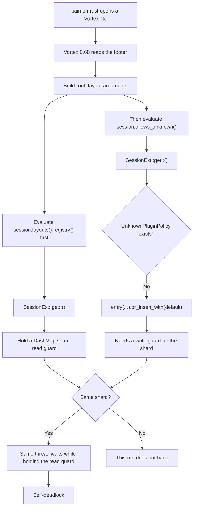

## 问题背景

一个稳定的 CI 对于开源项目来说是至关重要的，如果提交 PR 大概率因为 CI 不稳定导致爆红，对于贡献者来说是比较打击积极性的。在前段时间，paimon-rust 的 GitHub CI 频繁卡在 Vortex 相关测试上。修过几轮，每次看起来好了，过几天又会复发，很是烦人。好在成功修复了，写这篇博客来简单记录一下。

最近一次比较完整的现场是 [CI run 27869393079](https://github.com/apache/paimon-rust/actions/runs/27869393079)：`integration` job 里的 `DataFusion Vortex Integration Test` step 卡在 `test_vortex_file_format_sql_e2e`，日志停在 `has been running for over 60 seconds`，之后一直没有新的测试输出。这个 step 从 2026-06-20 11:21:40 UTC 跑到 17:12:06 UTC，接近 6 小时后被 Actions 取消。从现象来看可以定位是测试 hang 住了。不过比较奇怪的一点，在自己的开发环境，执行对应的测试，复现不出来（后面在 AI 的帮助下通过限制 CPU 能够大概率复现）。

既然不好复现，倒不如直接顺着支持 Vortex 的时间线重新梳理一遍，如下：

Vortex 支持最早来自 [`feat: add Vortex columnar file format support as optional feature`](https://github.com/apache/paimon-rust/pull/260)。这个 PR 在 `crates/paimon/Cargo.toml` 里引入了 Vortex `0.68`：

```toml
vortex = { version = "0.68", features = ["tokio"], optional = true }
```

简单概括下这个 RP 的内容：新增了 `crates/paimon/src/arrow/format/vortex.rs`，实现 Vortex 文件读写、predicate pushdown 和 row selection，并把 `vortex` feature 加进 clippy、build 和 unit CI。也就是说，从 #260 开始，Vortex 读写路径进入了常规 CI。

但这次挂住的 DataFusion SQL e2e 测试不是 #260 带来的，而是后面的 [`test(datafusion): add vortex SQL e2e`](https://github.com/apache/paimon-rust/pull/321)。#321 新增了 `crates/integrations/datafusion/tests/vortex_tables.rs`，并在 CI 里加了单独的 `DataFusion Vortex Integration Test` step：

```bash
cargo test -p paimon-datafusion --features vortex --test vortex_tables
```

第一次比较明确的 Vortex hang 线索出现在 [`build: pin unicode-segmentation for vortex tests`](https://github.com/apache/paimon-rust/pull/353)。当时 revert 其他改动后，main CI 仍然 hanging。对比挂住的 Ubuntu unit job，差异集中在 Vortex tests 解析出来的依赖集合上。#353 先把 `unicode-segmentation` pin 到 `=1.13.2`，目标很直接：先让 CI 恢复。

之后问题又复发，我顺着这个方向提了个 PR，从依赖解析转向 Vortex 读写路径本身。[`fix: keep Vortex runtime alive during async IO`](https://github.com/apache/paimon-rust/pull/375) 处理的是 runtime handle 生命周期：旧代码直接用 `VortexSession::default()`，async read/write 可能比临时 runtime owner 活得更久，后面的 background IO task 没有可用 executor 时就会 stall。

再后面是之信老师提的 [`fix: stabilize Vortex runtime for async IO`](https://github.com/apache/paimon-rust/pull/387)。这个 PR 把 Vortex read/write 移到 dedicated blocking thread 和 `CurrentThreadRuntime` 上；读取时改用 `open_buffer`，写入时先序列化到内存 buffer，同时绕开 Vortex `0.68` 的 filtered-scan 路径。

回头看，这几次修复都不是无效的。它们分别处理了当时暴露出来的依赖解析、runtime 生命周期、scan/write 问题，所以 CI 能阶段性恢复。但这次 integration cancellation 又把问题收窄到了另一条路径：打开 Vortex 文件、读取 footer、构建 layout。

## 先确认现象

我把问题先拆成两类：

1. Vortex 读写路径是否会 hang。
2. integration tests 是否只是缺少外部 fixture。

复现时聚焦 DataFusion 的 Vortex 表测试，并加上 timeout：

```bash
timeout 150s taskset -c 0 \
  cargo test -p paimon-datafusion --features vortex --test vortex_tables -- --nocapture
```

在 Vortex `0.68` 路径上，测试可以卡在 `test_vortex_file_format_sql_e2e`，直到 timeout。这个现象和 [CI run 27869393079](https://github.com/apache/paimon-rust/actions/runs/27869393079) 对得上：step 编译完成后运行 1 个测试，`test_vortex_file_format_sql_e2e` 超过 60 秒没有结束，之后长时间没有新的输出，最后只看到 `The operation was canceled`。

通过 `taskset -c 0` 只是让本地更接近受限 runner 的调度环境，然后可以高概率的复现出 hang 的现象，在后面的排查中发现并不是根因哦。

CI 里对应的 step 跑在 `ubuntu-latest` 上：

```bash
cargo test -p paimon-datafusion --features vortex --test vortex_tables
```

另一个干扰项也要排掉：有些 integration tests 如果缺少预置 Paimon 表 fixture，会以 `TableNotExist` 失败，例如 `default.partitioned_log_table`、`default.multi_partitioned_log_table`。这类失败会明确 panic，和测试进程无输出卡住不是一回事。

## paimon-rust 是怎么触发的

paimon-rust 的 Vortex reader 会在 blocking task 中创建 Vortex session，然后打开 Vortex 文件：

```rust
let runtime = CurrentThreadRuntime::new();
let session = VortexSession::default().with_handle(runtime.handle());
read_vortex_batches(&runtime, session, ByteBuffer::from(bytes), plan)
```

后面的 `read_vortex_batches` 会通过 Vortex open/scan API 读取文件。DataFusion SQL 层、paimon-rust 的 projection/filter 逻辑都只是入口；真正卡住的位置在 Vortex 打开文件并读取 footer 的过程中。

## 回到 Vortex 0.68 源码

有了上述的排查过程，根据 Vortex 0.68 的源码来一探究竟，可以发现 footer 反序列化代码在 `vortex-file/src/footer/mod.rs`。关键调用长这样：

```rust
let root_layout = layout_from_flatbuffer_with_options(
    layout_bytes,
    &dtype,
    &layout_read_ctx,
    &array_read_ctx,
    session.layouts().registry(),
    session.allows_unknown(),
)?;
```

这里有两个参数看起来都只是读 session：

- `session.layouts().registry()`
- `session.allows_unknown()`

问题就藏在这两个参数的求值过程中。

先看 `session.layouts()`。它来自 `vortex-layout/src/session.rs`：

```rust
fn layouts(&self) -> Ref<'_, LayoutSession> {
    self.get::<LayoutSession>()
}
```

`registry()` 返回的是 `&LayoutRegistry`。为了把这个引用传给 `layout_from_flatbuffer_with_options(...)`，`session.layouts()` 返回的 `Ref<'_, LayoutSession>` 需要至少活到这次函数调用结束。这个 `Ref` 内部包着 DashMap 的 read guard。

再补一层 Rust 的求值语义：函数调用参数会按源码顺序求值。也就是说，`session.layouts().registry()` 先拿到 `LayoutSession` 的 guard；等右侧 `session.allows_unknown()` 开始执行时，前面的 guard 还没释放。

接着看 `session.allows_unknown()`。Vortex `0.68` 里的实现是：

```rust
pub fn allows_unknown(&self) -> bool {
    <Self as SessionExt>::get::<UnknownPluginPolicy>(self).allow_unknown
}
```

这里的 `get::<V>()` 不是纯读。session var 不存在时，它会懒插入默认值：

```rust
if let Some(v) = self.0.get(&TypeId::of::<V>()) {
    return Ref(...);
}

Ref(self
    .0
    .entry(TypeId::of::<V>())
    .or_insert_with(|| Box::new(V::default()))
    .downgrade()
    .map(...))
```

`self.0` 是 `DashMap<TypeId, Box<dyn SessionVar>, ...>`。所以 `allows_unknown()` 这个名字虽然像读操作，但当 `UnknownPluginPolicy` 还没初始化时，它会走到 `entry(...).or_insert_with(...)`，需要拿对应 shard 的写锁。

这也解释了为什么受限 runner 或 `taskset -c 0` 更容易复现。DashMap 的默认 shard 数量来自 `(available_parallelism * 4).next_power_of_two()`；可用 CPU 越少，默认 shard 越少，`LayoutSession` 和 `UnknownPluginPolicy` 落到同一个 shard 的概率越高。资源约束放大的是概率，不是根因。根因仍然是 footer 解析期间，一个看似只读的 session 查询走进了写路径。

整个链路可以画成这样：



所以这里不是普通的多线程竞态。一条线程就够了：它先持有一个 shard 的 read guard，又在同一个调用语句里尝试拿同一个 shard 的 write guard，于是把自己等死。表现出来就是没有 panic、没有错误返回，测试进程安静地卡在那里。

## 上游代码的印证

Vortex 的历史 PR 可以把这条链路串起来。

先看 [vortex-data/vortex#7347](https://github.com/vortex-data/vortex/pull/7347)（`Allow loading "foreign" plugins for UI/TUI/Serde`）。这个 PR 在 2026-04-09 合入，做了两件和本问题相关的事：

1. 在 `vortex-session/src/lib.rs` 中新增 `UnknownPluginPolicy`、`allow_unknown()` 和 `allows_unknown()`。
2. 在 `vortex-file/src/footer/mod.rs` 中把 footer layout 解析改成 `layout_from_flatbuffer_with_options(...)`，并传入 `session.layouts().registry()` 和 `session.allows_unknown()`。

当时 `allows_unknown()` 用的是 `get::<UnknownPluginPolicy>()`，因此默认 policy 不存在时会懒初始化，也就是会写 session map。

随后 [vortex-data/vortex#7606](https://github.com/vortex-data/vortex/pull/7606)（`fix deadlock on unknown policy request`）改了 `allows_unknown()`：

```diff
 pub fn allows_unknown(&self) -> bool {
-    <Self as SessionExt>::get::<UnknownPluginPolicy>(self).allow_unknown
+    <Self as SessionExt>::get_opt::<UnknownPluginPolicy>(self)
+        .map(|p| p.allow_unknown)
+        .unwrap_or(false)
 }
```

这里要把证据边界说清楚：#7606 的触发场景来自 Vortex 自己的 FFI tests，不是 paimon-rust 的复现。但它改掉的正是同一个机制：`allows_unknown()` 从懒写入变成只读查询；policy 不存在时直接返回 `false`。这样 footer 解析期间就不会一边持有 `LayoutSession` borrow，一边再去写 session map。

再看当前 `upstream/develop`。同一块代码后来继续演进，footer 读取仍然会把 `session.allows_unknown()` 的结果传给 layout 反序列化：

```rust
let root_layout = layout_from_flatbuffer_with_options(
    layout_bytes,
    &dtype,
    &layout_read_ctx,
    &array_read_ctx,
    session,
    session.allows_unknown(),
)?;
```

但 session 实现已经变成 immutable map：session variables 在构造后固定，读取时返回普通引用，不再通过 DashMap guard 管理生命周期。当前 `allows_unknown()` 也是纯读：

```rust
pub fn allows_unknown(&self) -> bool {
    self.get_opt::<UnknownPluginPolicy>()
        .is_some_and(|p| p.allow_unknown)
}
```

这里也要区分版本：paimon-rust 最终升级到的 Vortex `0.75.0` 已经包含 #7606，因此 `allows_unknown()` 不再懒写入；但 `0.75.0` 的 session 还没有变成 immutable map。immutable map 是当前 `develop` 的进一步演进，它说明上游后来从更底层把这类读写锁生命周期问题也收掉了，但不是 paimon-rust 修复这次 CI hang 的必要条件。

## 解决方案

对 paimon-rust 来说，合适的修复边界在依赖升级和 API 适配上。也可以在 paimon-rust 侧针对 Vortex `0.68` 写 workaround，比如提前初始化 `UnknownPluginPolicy`，但这会把 Vortex 内部实现细节漏到 paimon-rust 里，后续维护成本也会留在自己这边。和之信老师讨论之后，决定还是升级依赖更合适。

Vortex `0.75.0` 已经包含 #7606。同样的 footer 读取路径下，`session.allows_unknown()` 不再写 session map，也就不会在持有 `LayoutSession` borrow 的同时再申请写锁。

对应 paimon-rust 的修复收敛成三部分：

1. 将 `crates/paimon/Cargo.toml` 中的 Vortex 依赖从 `0.68` 升级到 `0.75.0`。
2. 适配新版 Vortex Arrow conversion API，用 session execution API 替代 deprecated `IntoArrowArray::into_arrow`。
3. 将 workspace `rust-version` 从 `1.86.0` 提到 `1.91.0`，同时把 `constant_time_eq` 从 `<0.5.1` 收紧到 `<0.5.0`。原因是 `constant_time_eq 0.5.0` 要求 Rust `1.95.0`，fresh resolver 选到它以后会超过当前 workspace MSRV。

对应修复已经通过 [`fix(vortex): avoid footer read deadlock`](https://github.com/apache/paimon-rust/pull/402) 合并。

## 验证

验证分两步：先证明 hang 消失，再确认依赖升级没有破坏常规检查。

关键回归测试还是同一个：

```bash
timeout 120s taskset -c 0 \
  cargo test -p paimon-datafusion --features vortex --test vortex_tables -- --nocapture
```

升级到 Vortex `0.75.0` 并适配 API 后，这个测试可以稳定完成，`test_vortex_file_format_sql_e2e` 通过。

paimon-rust 的修复 PR [apache/paimon-rust#402](https://github.com/apache/paimon-rust/pull/402) 于 2026-06-22 合入。对应 [CI run 27923915415](https://github.com/apache/paimon-rust/actions/runs/27923915415) 全部通过，其中 `integration` job 和 `DataFusion Vortex Integration Test` step 都是 `success`。

常规检查包括：

```bash
cargo fmt --all -- --check
cargo clippy --all-targets --workspace --features fulltext,vortex,mosaic -- -D warnings
cargo build --features fulltext,vortex,mosaic
cargo test -p paimon --all-targets --features fulltext,vortex,mosaic
```

其中 `paimon` crate 的测试覆盖了 Vortex reader/writer 单元测试、predicate 读取、empty projection、row selection 和并发 predicate read 等路径。

最后再强调一下 fixture 问题：依赖外部 fixture 的 integration read tests 如果缺少预置表，会以 `TableNotExist` 失败。这类失败和本次 Vortex hang 是两条线，不能混成一个根因。

## 最新状态

这篇文章写完时，相关修复已经进入 main，PR [apache/paimon-rust#402](https://github.com/apache/paimon-rust/pull/402)。合入后的 main push CI 是 [run 27925299942](https://github.com/apache/paimon-rust/actions/runs/27925299942)，结果为 `success`；其中 `DataFusion Vortex Integration Test` 也能够正常跑通。

目前来看 paimon-rust 的 PR 可以发现已经可以正常运行，没有再出现 Vortex test 夯住的情况了。想要参与的同学可以一起来愉快地玩耍啦~

## 结论

啰里八唆写了一堆，简单总结下这次 CI hang 的根因，是 Vortex `0.68` 的 session 读取接口里藏了一条写路径：

- footer 解析时，先通过 `session.layouts().registry()` 保留了 `LayoutSession` 的 session borrow；
- 同一个函数调用里，又继续执行 `session.allows_unknown()`；
- Vortex `0.68` 的 `allows_unknown()` 会通过 `get::<UnknownPluginPolicy>()` 懒插入默认 policy；
- 如果这次写入和前面尚未释放的 `LayoutSession` borrow 落到同一个 DashMap shard，同一线程就会在持有 read guard 的情况下等待 write guard，形成自死锁。

Vortex 上游已经通过 [vortex-data/vortex#7606](https://github.com/vortex-data/vortex/pull/7606) 把 `allows_unknown()` 改成 `get_opt()`，让默认 `false` 变成真正的只读路径。paimon-rust 侧升级到包含这个修复的 Vortex 版本，并完成必要 API 适配，是边界最清楚的修法。
